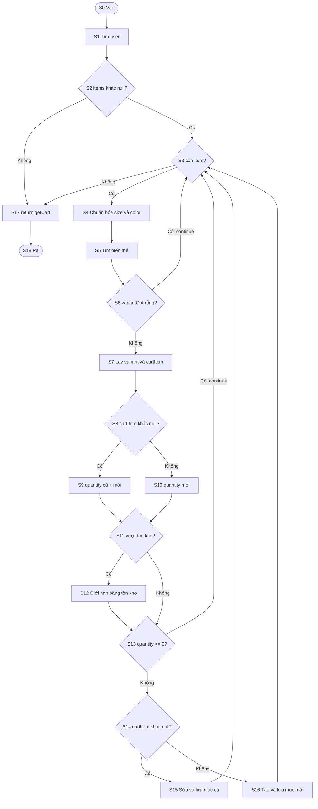
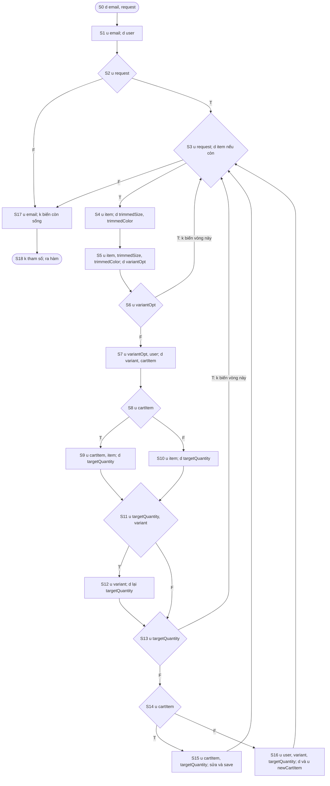
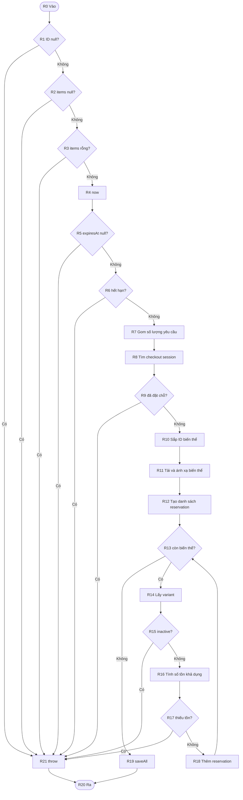
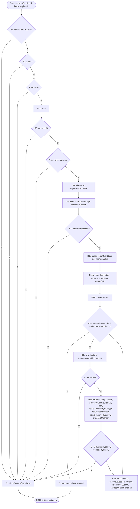

# Kiểm thử hộp trắng hai đơn vị mã nguồn CLOTHY

## Quy ước và ranh giới

Hai đơn vị được phân tích là `CartServiceImpl.syncCart` (dòng 202–255) và `InventoryReservationServiceImpl.reserveStock` (dòng 38–94), theo phiên bản mã nguồn tại thời điểm lập báo cáo. Mỗi đồ thị bắt đầu ở đầu phương thức và kết thúc ở `return`, hết phương thức hoặc `throw`. Điều kiện `||` được tách theo thứ tự đánh giá ngắn mạch. Lời gọi repository, `getCart`, `collectRequestedQuantities`, `toVariantMap`, `safeStockQuantity` và `safeReservedQuantity` là nút xử lý nguyên tử của **phương thức đang xét**; nhánh bên trong chúng không được cộng vào độ phức tạp của phương thức này. Ngoại lệ do lời gọi ngoài ném ra được kiểm thử bổ sung, không được tính thành nút quyết định của đồ thị dưới đây.

Trong đồ thị dòng dữ liệu, `d` là gán/định nghĩa giá trị, `u` là đọc giá trị và `k` là kết thúc phạm vi của biến. Tham số được `d` khi vào phương thức. Với Java, `k` ở đây là kết thúc vòng đời **biến tham chiếu cục bộ**, không có nghĩa đối tượng trên heap bị hủy ngay. Khai báo `int targetQuantity;` chưa phải `d`: biến chỉ được định nghĩa ở một trong hai phép gán tiếp theo. `cartItem.setQuantity(...)` và `reservations.add(...)` là thay đổi trạng thái đối tượng, không phải gán lại biến tham chiếu.

Tài liệu dùng để thống nhất phương pháp: `KiemThuHopTrang_Phan1.pdf` (đồ thị cơ bản, đường độc lập, vòng lặp) và `KiemThuHopTrang_Phan2.pdf` (đồ thị dữ liệu, cặp `d/u/k`).

## 1. `CartServiceImpl.syncCart`

### 1.1. Đồ thị dòng điều khiển cơ bản

| Nút | Mã nguồn / vai trò |
|---|---|
| S0 | Vào hàm; tham số `email`, `request` |
| S1 | Tìm `user` theo email, nếu không có thì lời gọi `orElseThrow` ném lỗi |
| S2 | `request.items() != null` |
| S3 | Kiểm tra còn `item` trong vòng `for` |
| S4 | `trimmedSize`, `trimmedColor` |
| S5 | Tìm `variantOpt` |
| S6 | `variantOpt.isEmpty()` |
| S7 | Lấy `variant`, tìm `cartItem` |
| S8 | `cartItem != null` để tính số lượng |
| S9 / S10 | `targetQuantity` bằng số lượng cũ cộng mới / số lượng mới |
| S11 | `targetQuantity > variant.getStockQuantity()` |
| S12 | Giới hạn `targetQuantity` bằng tồn kho |
| S13 | `targetQuantity <= 0` |
| S14 | `cartItem != null` để chọn cập nhật hay tạo mới |
| S15 / S16 | Cập nhật mục cũ / tạo `newCartItem`, rồi `save` |
| S17 | `return getCart(email)` |
| S18 | Ra hàm |



Đồ thị có **N = 19 nút, E = 25 cung** và **P = 7 nút quyết định** (`S2`, `S3`, `S6`, `S8`, `S11`, `S13`, `S14`). Hai phép kiểm tra `cartItem != null` vẫn là hai nút riêng vì chúng xuất hiện ở hai vị trí khác nhau. Do đó `V(G) = E − N + 2 = 25 − 19 + 2 = 8 = P + 1`.

### 1.2. Đường độc lập và test case

Quy ước `A = S0→S1→S2→S3→S4→S5→S6`; mỗi đường trong bảng bắt đầu từ `S0`, kết thúc tại `S18`. Giá sản phẩm mock là **100.000 VND/đơn vị**. `findAllByUserId` đọc cùng danh sách trong bộ nhớ mà `save` cập nhật, vì vậy `getCart` trả về kết quả nhất quán với thao tác lưu.

| TC | Đường nút | Dữ liệu quyết định / mock | Kỳ vọng và test JUnit |
|---|---|---|---|
| **C01** | `S0→S1→S2→S17→S18` | `items=null`, user tồn tại | Giỏ rỗng, không `save`; `wbC01_nullItems_returnsEmptyCart` |
| **C02** | `S0→S1→S2→S3→S17→S18` | `items=[]` | Giỏ rỗng, vòng lặp 0 lần; `wbC02_emptyItems_skipsLoop` |
| **C03** | `A→S3→S17→S18` | Một item, không tìm thấy biến thể | `continue`, không `save`; `wbC03_unknownVariant_continuesWithoutSaving` |
| **C04** | `A→S7→S8→S9→S11→S13→S14→S15→S3→S17→S18` | Mục cũ 2, thêm 1, tồn 5 | Lưu số lượng 3, tổng 300.000; `wbC04_existingItem_withoutCap_increasesQuantity` |
| **C05** | `A→S7→S8→S10→S11→S13→S14→S16→S3→S17→S18` | Chưa có mục, thêm 2, tồn 5 | Tạo mục số lượng 2, tổng 200.000; `wbC05_newItem_withoutCap_isSaved` |
| **C06** | `A→S7→S8→S10→S11→S12→S13→S14→S16→S3→S17→S18` | Chưa có mục, thêm 8, tồn 5 | Giới hạn còn 5, tổng 500.000; `wbC06_newItem_aboveStock_isCappedAndSaved` |
| **C07** | `A→S7→S8→S10→S11→S12→S13→S3→S17→S18` | Chưa có mục, thêm 1, tồn 0 | Giới hạn về 0 rồi `continue`, không `save`; `wbC07_zeroStock_skipsNewItemAfterCap` |
| **C09** | `A→S7→S8→S9→S11→S12→S13→S3→S17→S18` | Mục cũ 2, thêm 1, tồn 0 | Mục cũ không đổi, không `save`; `wbC09_existingItemAtZeroStock_isNotUpdated` |

Tám đường **C01–C07 và C09** là cơ sở độc lập trên 25 cung của đồ thị. C09 cần thiết vì `S8` và `S14` cùng đọc `cartItem`: tổ hợp “mục cũ, rồi bỏ qua trước S14” giúp tách ảnh hưởng của hai quyết định này. **C08** (`wbC08_twoItems_traversesLoopBackEdge`) là ca bổ sung chạy hai vòng, lưu hai mục và kiểm tra tổng 300.000; nó không làm tăng số chiều của cơ sở. **C10** (`wbC10_unknownUser_failsBeforeLoop`) kiểm tra ngoại lệ của `orElseThrow` ở S1, nằm ngoài các nút quyết định đã đếm. `items=null` ở C01 có thể gọi trực tiếp service nhưng bị `@NotNull` chặn khi đi qua HTTP controller.

### 1.3. Đồ thị dòng dữ liệu chung và đời sống biến

Các cung dưới đây giống đồ thị điều khiển; nhãn nút bổ sung thao tác biến. `u+` trong bảng nghĩa là một hoặc nhiều lần sử dụng, có thể kiểm lại số lần chính xác theo nút trên đồ thị. Ở S3, biến `item` được `d` **mỗi lần** vòng lặp lấy phần tử mới.



Ký hiệu `—` nghĩa là biến không được tạo trong đường đó. Bảng bao phủ toàn bộ tham số và biến cục bộ; `k` ở cuối từng chuỗi được hiểu là cuối vòng lặp hoặc cuối hàm theo phạm vi của biến.

| Biến | Đường | Chuỗi đời sống và nhận xét |
|---|---|---|
| `email` | C01–C09 | `d→u(S1)→u(S17)→k` |
| `request` | C01 | `d→u(S2)→k` |
| `request` | C02–C07, C09 | `d→u(S2)→u+(S3)→k`; C08 thêm lần kiểm tra S3 |
| `user` | C01–C03 | `d(S1)→k`; giá trị không được dùng tiếp, nhưng việc tìm user là điều kiện tồn tại tài khoản |
| `user` | C04–C07, C09 | `d(S1)→u(S7)→k`; C08 dùng ở hai vòng |
| `item` | C01–C02 | — |
| `item` | C03–C07, C09 | `d(S3)→u+(S4,S5 và S9/S10 nếu tới đó)→k`; C08 có hai chu kỳ riêng |
| `trimmedSize` | C01–C02 | — |
| `trimmedSize` | C03–C07, C09 | `d(S4)→u(S5)→k`; C08 lặp chu kỳ này hai lần |
| `trimmedColor` | C01–C02 | — |
| `trimmedColor` | C03–C07, C09 | `d(S4)→u(S5)→k`; C08 lặp chu kỳ này hai lần |
| `variantOpt` | C01–C02 | — |
| `variantOpt` | C03 | `d(S5)→u(S6)→k` |
| `variantOpt` | C04–C07, C09 | `d(S5)→u(S6)→u(S7)→k` |
| `variant` | C01–C03 | — |
| `variant` | C04–C07, C09 | `d(S7)→u+(S11, S12 nếu giới hạn, S16 nếu tạo mới)→k`; C08 lặp hai chu kỳ |
| `cartItem` | C01–C03 | — |
| `cartItem` | C04–C07, C09 | `d(S7)→u+(S8, S9 nếu có, S14/S15 nếu không bỏ qua)→k`; C08 lặp hai chu kỳ |
| `targetQuantity` | C01–C03 | — |
| `targetQuantity` | C04–C05 | `d(S9/S10)→u(S11)→u(S13)→u(S15/S16)→k` |
| `targetQuantity` | C06 | `d(S10)→u(S11)→d(S12)→u(S13)→u(S16)→k` |
| `targetQuantity` | C07, C09 | `d(S10/S9)→u(S11)→d(S12)→u(S13)→k` |
| `newCartItem` | C05–C06 | `d(S16)→u(S16 save)→k`; C08 thực hiện hai chu kỳ |
| `newCartItem` | C01–C04, C07, C09 | — |

`targetQuantity` có cặp `ud` khi bị giới hạn ở S12, là phép cập nhật có chủ đích. `user` có `dk` ở đường kết thúc sớm, cần ghi nhận nhưng không phải lỗi dùng biến chưa định nghĩa. Không thấy `~u`, `ku` hay `kk` trong các đường đã chọn. C08 có thể suy ra bằng cách ghép hai chu kỳ S3–S16 của bảng.

## 2. `InventoryReservationServiceImpl.reserveStock`

### 2.1. Đồ thị dòng điều khiển cơ bản

| Nút | Mã nguồn / vai trò |
|---|---|
| R0 | Vào hàm; ba tham số |
| R1 | `checkoutSessionId == null` |
| R2 / R3 | `items == null` / `items.isEmpty()` |
| R4 | Gán `now` |
| R5 / R6 | `expiresAt == null` / `!expiresAt.isAfter(now)` |
| R7 | `requestedQuantities = collectRequestedQuantities(items)` |
| R8 | Tìm `checkoutSession` |
| R9 | Đã có reservation cho checkout? |
| R10 | Tạo `sortedVariantIds` |
| R11 | Tải `variants`, tạo `variantById` |
| R12 | Tạo danh sách `reservations` |
| R13 | Kiểm tra còn `productVariantId` trong vòng `for` |
| R14 | Lấy `variant` |
| R15 | Biến thể không hoạt động? |
| R16 | Lấy `requestedQuantity`, `activeReservedQuantity`; tính `availableQuantity` |
| R17 | `availableQuantity < requestedQuantity` |
| R18 | Thêm reservation vào danh sách |
| R19 | `saveAll(reservations)` |
| R20 / R21 | Ra hàm / ném ngoại lệ rồi ra hàm |



Đồ thị có **N = 22, E = 30, P = 9**, với các quyết định `R1`, `R2`, `R3`, `R5`, `R6`, `R9`, `R13`, `R15`, `R17`. Do đó `V(G) = 30 − 22 + 2 = 10 = 9 + 1`. R2/R3 và R5/R6 là hai cặp nút tách từ điều kiện `||`, nên nhánh ngắn mạch không bị bỏ sót.

### 2.2. Đường độc lập và test case

Quy ước `Q = R0→R1→R2→R3→R4→R5→R6`; thời điểm hết hạn được đặt cách hiện tại một giờ để tránh test chập chờn. Cả mười đường dưới đây khả thi khi gọi trực tiếp service. Với dữ liệu hợp lệ, `items` không rỗng nên vòng R13 chạy ít nhất một lần; **R10 dùng hai biến thể để phân biệt một lần và hai lần lặp**, thay vì giả tạo một danh sách biến thể rỗng.

| TC | Đường nút | Dữ liệu quyết định / mock | Kỳ vọng và test JUnit |
|---|---|---|---|
| **R01** | `R0→R1→R21→R20` | `checkoutSessionId=null` | `IllegalArgumentException`, không gọi repository; `wbR01_nullCheckoutSessionId_throwsBeforeRepositoryAccess` |
| **R02** | `R0→R1→R2→R21→R20` | `items=null` | `IllegalArgumentException`, không gọi repository; `wbR02_nullItems_throwsBeforeRepositoryAccess` |
| **R03** | `R0→R1→R2→R3→R21→R20` | `items=[]` | `IllegalArgumentException`; `reserveStock_emptyItems_throwsException` |
| **R04** | `R0→R1→R2→R3→R4→R5→R21→R20` | `expiresAt=null` | `IllegalArgumentException`; `wbR04_nullExpiresAt_throwsBeforeRepositoryAccess` |
| **R05** | `Q→R21→R20` | `expiresAt` ở quá khứ | `IllegalArgumentException`; `reserveStock_invalidExpiresAt_throwsException` |
| **R06** | `Q→R7→R8→R9→R21→R20` | Reservation đã tồn tại | `InvalidDataException`, không `saveAll`; `reserveStock_existingReservation_throwsException` |
| **R07** | `Q→R7→R8→R9→R10→R11→R12→R13→R14→R15→R21→R20` | Biến thể `isActive=false` | `IllegalArgumentException`, không `saveAll`; `reserveStock_productVariantInactive_throwsException` |
| **R08** | `Q→R7→R8→R9→R10→R11→R12→R13→R14→R15→R16→R17→R21→R20` | Tồn 10, đã giữ 5, yêu cầu 6 | `InsufficientStockException`, không `saveAll`; `reserveStock_notEnoughAfterSubtractingActiveReservation_throwsException` |
| **R09** | Như R08 tới `R17→R18→R13→R19→R20` | Một biến thể, tồn 5, yêu cầu 2 | Lưu đúng một reservation, tồn kho chưa bị trừ; `reserveStock_oneVariant_success` |
| **R10** | Như R09, thêm `R14→R15→R16→R17→R18→R13` trước R19 | Hai biến thể, đầu vào đảo thứ tự ID | Lưu hai reservation theo ID tăng dần; `reserveStock_multipleVariants_success` |

Các lỗi từ hàm phụ/repository đã có test riêng trong lớp hiện hữu: số lượng yêu cầu 0, ID biến thể trùng, biến thể không tìm thấy và checkout session không tìm thấy. Chúng bổ sung độ tin cậy, nhưng không thay thế R01–R10 của đồ thị `reserveStock`.

### 2.3. Đồ thị dòng dữ liệu chung và đời sống biến



Ở R11, `variants` được định nghĩa khi tải từ repository rồi dùng để tạo `variantById`. Ở R16, `activeReservedQuantity` được định nghĩa từ repository rồi dùng để tính `availableQuantity`; nhãn gộp trong hình diễn tả hai bước tuần tự, **không phải dùng trước khi định nghĩa**. Đối tượng trong `reservations` được thêm phần tử ở R18; biến tham chiếu không được định nghĩa lại.

| Biến | Đường | Chuỗi đời sống và nhận xét |
|---|---|---|
| `checkoutSessionId` | R01 | `d→u(R1)→k` |
| `checkoutSessionId` | R02–R05 | `d→u(R1)→k` |
| `checkoutSessionId` | R06–R10 | `d→u(R1)→u(R8)→u(R9)→k` |
| `items` | R01 | `d→k` do thoát trước R2 |
| `items` | R02 | `d→u(R2)→k` |
| `items` | R03–R10 | `d→u(R2)→u(R3)→u(R7 nếu tới)→k` |
| `expiresAt` | R01–R03 | `d→k` |
| `expiresAt` | R04 | `d→u(R5)→k` |
| `expiresAt` | R05–R08 | `d→u(R5)→u(R6)→k` |
| `expiresAt` | R09–R10 | `d→u(R5)→u(R6)→u+(R18)→k` |
| `now` | R01–R03 | — |
| `now` | R04 | `d(R4)→k` vì R5 ném lỗi |
| `now` | R05–R07 | `d(R4)→u(R6)→k` |
| `now` | R08–R10 | `d(R4)→u(R6)→u+(R16)→k` |
| `requestedQuantities` | R01–R05 | — |
| `requestedQuantities` | R06 | `d(R7)→k` khi reservation đã tồn tại |
| `requestedQuantities` | R07–R10 | `d(R7)→u(R10)→u+(R16 nếu tới)→k` |
| `checkoutSession` | R01–R05 | — |
| `checkoutSession` | R06–R08 | `d(R8)→k` trước khi thêm reservation |
| `checkoutSession` | R09–R10 | `d(R8)→u+(R18)→k` |
| `sortedVariantIds` | R01–R06 | — |
| `sortedVariantIds` | R07–R10 | `d(R10)→u(R11)→u+(R13)→k` |
| `variants` | R01–R06 | — |
| `variants` | R07–R10 | `d(R11)→u(R11, toVariantMap)→k` |
| `variantById` | R01–R06 | — |
| `variantById` | R07–R10 | `d(R11)→u+(R14)→k` |
| `reservations` | R01–R06 | — |
| `reservations` | R07–R08 | `d(R12)→k`; danh sách rỗng bị bỏ khi ném lỗi |
| `reservations` | R09–R10 | `d(R12)→u+(R18)→u(R19)→k` |
| `productVariantId` | R01–R06 | — |
| `productVariantId` | R07–R10 | `d(R13)→u(R14)→u+(R16 nếu tới)→k`; R10 có hai chu kỳ |
| `variant` | R01–R06 | — |
| `variant` | R07–R10 | `d(R14)→u(R15)→u+(R16/R18 nếu tới)→k` |
| `requestedQuantity` | R01–R07 | — |
| `requestedQuantity` | R08–R10 | `d(R16)→u(R17)→u+(R18 nếu thành công)→k` |
| `activeReservedQuantity` | R01–R07 | — |
| `activeReservedQuantity` | R08–R10 | `d(R16)→u(R16)→k` |
| `availableQuantity` | R01–R07 | — |
| `availableQuantity` | R08–R10 | `d(R16)→u(R17)→k`; R08 còn dùng trong thông báo lỗi |

Các cặp `dk` trên đường ném lỗi phản ánh thoát sớm sau khi đã tính hoặc tải một giá trị; không có bằng chứng dùng giá trị chưa định nghĩa. Việc cấp phát `reservations` trước khi phát hiện biến thể inactive/thiếu tồn kho có thể tránh được, nhưng đó là chi phí nhỏ trên đường lỗi, chưa phải sai chức năng. Không thấy `~u`, `ku` hoặc `kk` trên mười đường. `R10` lặp lại chu kỳ `d→u...→k` của biến vòng và thêm lần `u(R18)` đối với danh sách `reservations`.

## 3. Đối chiếu kết quả chạy test

Các test dùng JUnit 5 và Mockito, không cần kết nối database. Lệnh đã chạy từ thư mục `Clothing-Store-Backend` bằng JDK 17:

```powershell
$env:JAVA_HOME='D:\Java\jdk-17'
$env:MAVEN_OPTS='-Xmx512m'
mvn -q '-DforkCount=0' '-Dtest=CartServiceImplWhiteBoxTest,InventoryReservationServiceImplTest' test
```

**Kết quả:** `CartServiceImplWhiteBoxTest` có **10/10** test pass; `InventoryReservationServiceImplTest` có **29/29** test pass; tổng **39 test, 0 failure, 0 error, 0 skipped** theo báo cáo Surefire. Lần chạy Maven thông thường dùng JDK 26 gây lỗi tương thích với Lombok; dùng JDK 17 biên dịch thành công. Surefire chạy trong JVM riêng từng bị thiếu paging file, nên lệnh trên đặt `forkCount=0`. Các con số `V(G)` và tập đường độc lập là kết quả đối chiếu thủ công trên đồ thị nguồn, không phải số đo JaCoCo.
