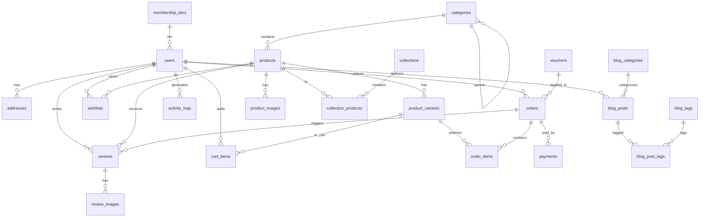

# Thiết kế Cơ sở dữ liệu — Website Bán Quần Áo

> **Nhóm 10** | PostgreSQL 16 | Cập nhật: 2026-05-31

---

## 1. Tổng quan

Cơ sở dữ liệu được thiết kế cho hệ thống "Website Bán Quần Áo" với **23 bảng**, sử dụng **PostgreSQL 16** chạy trên Docker container trong VPS (theo kiến trúc hạ tầng đã thiết kế).

### 1.1. Thông số kỹ thuật

| Thuộc tính | Giá trị |
|-----------|---------|
| **DBMS** | PostgreSQL 16 (Alpine) |
| **Extensions** | `pg_trgm` (tìm kiếm), `pgcrypto` (mã hóa) |
| **Encoding** | UTF-8 |
| **Timezone** | Asia/Ho_Chi_Minh |
| **Số bảng** | 23 |
| **Normalization** | 3NF |

### 1.2. Quyết định thiết kế

| Quyết định | Lựa chọn | Lý do |
|-----------|----------|-------|
| **Primary Key** | `BIGSERIAL` (auto-increment) | Single DB, hiệu suất JOIN tốt hơn UUID, đơn giản |
| **Timestamps** | `TIMESTAMPTZ` | Luôn timezone-aware, tránh lỗi múi giờ |
| **Soft Delete** | `deleted_at TIMESTAMPTZ` | QĐ4: SP đã có đơn hàng chỉ ẩn, không xóa vật lý |
| **Danh mục đa cấp** | Self-referencing FK | QĐ5: tối đa 3 cấp, đơn giản, hiệu quả |
| **ENUM Types** | PostgreSQL native ENUM | Type-safe, tránh magic strings |
| **Kiểu tiền** | `NUMERIC(12,2)` | Chính xác tuyệt đối cho VNĐ, không dùng FLOAT |
| **Tìm kiếm** | `pg_trgm` + GIN index | Autocomplete, tìm kiếm fuzzy không cần Elasticsearch |
| **Phí ship** | Lưu trong `orders.shipping_fee` | App logic: đơn < 500K → 30K, đơn ≥ 500K → miễn phí |
| **Snapshot đơn hàng** | Copy address & price vào order | Đảm bảo tính toàn vẹn khi address/price thay đổi sau |

---

## 2. Sơ đồ quan hệ (ERD)



---

## 3. ENUM Types

| ENUM | Giá trị | Sử dụng tại |
|------|---------|-------------|
| `user_role` | `admin`, `customer` | `users.role` |
| `gender_type` | `male`, `female`, `other` | `users.gender` |
| `order_status` | `pending`, `processing`, `shipping`, `completed`, `cancelled` | `orders.status` |
| `payment_method` | `cod`, `vnpay`, `momo` | `payments.method` |
| `payment_status` | `pending`, `completed`, `failed`, `refunded` | `payments.status` |
| `discount_type` | `percentage`, `fixed_amount` | `vouchers.discount_type` |
| `image_type` | `main`, `thumbnail`, `gallery` | `product_images.image_type` |

---

## 4. Chi tiết từng bảng

### 4.1. Nhóm Người dùng

#### `membership_tiers` — Hạng thành viên

| Cột | Kiểu | Constraint | Mô tả |
|-----|------|-----------|-------|
| `id` | BIGSERIAL | PK | |
| `name` | VARCHAR(50) | NOT NULL, UNIQUE | Tên hạng (Đồng, Bạc, Vàng, Kim cương) |
| `slug` | VARCHAR(50) | NOT NULL, UNIQUE | URL-friendly |
| `min_points` | INTEGER | NOT NULL, DEFAULT 0 | Điểm tối thiểu để đạt hạng |
| `discount_percent` | NUMERIC(5,2) | NOT NULL, CHECK 0-100 | % giảm giá cho hạng |
| `description` | TEXT | | Mô tả |
| `created_at` | TIMESTAMPTZ | NOT NULL | |
| `updated_at` | TIMESTAMPTZ | NOT NULL | |

**Seed data:**

| Hạng | min_points | discount_percent | Ghi chú |
|------|-----------|-----------------|---------|
| Đồng | 0 | 0% | Mặc định khi đăng ký |
| Bạc | 500 | 3% | ~500K chi tiêu |
| Vàng | 2.000 | 5% | ~2M chi tiêu |
| Kim cương | 5.000 | 10% | ~5M chi tiêu |

#### `users` — Người dùng

| Cột | Kiểu | Constraint | Mô tả |
|-----|------|-----------|-------|
| `id` | BIGSERIAL | PK | |
| `email` | VARCHAR(255) | NOT NULL, UNIQUE | QĐ14: không được sửa, QĐ16: không trùng |
| `password_hash` | VARCHAR(255) | | NULL nếu OAuth (Google) |
| `full_name` | VARCHAR(100) | NOT NULL | |
| `phone` | VARCHAR(15) | | |
| `gender` | gender_type | | |
| `date_of_birth` | DATE | | |
| `avatar_url` | TEXT | | URL ảnh trên S3 |
| `role` | user_role | NOT NULL, DEFAULT 'customer' | admin / customer |
| `loyalty_points` | INTEGER | NOT NULL, DEFAULT 0, CHECK ≥ 0 | 1 điểm = 1.000 VNĐ |
| `membership_tier_id` | BIGINT | FK → membership_tiers | |
| `auth_provider` | VARCHAR(20) | DEFAULT 'email' | 'email' hoặc 'google' |
| `email_verified` | BOOLEAN | NOT NULL, DEFAULT FALSE | |
| `is_active` | BOOLEAN | NOT NULL, DEFAULT TRUE | |
| `last_login_at` | TIMESTAMPTZ | | |
| `created_at` | TIMESTAMPTZ | NOT NULL | |
| `updated_at` | TIMESTAMPTZ | NOT NULL | |
| `deleted_at` | TIMESTAMPTZ | | Soft delete |

#### `addresses` — Địa chỉ giao hàng

| Cột | Kiểu | Constraint | Mô tả |
|-----|------|-----------|-------|
| `id` | BIGSERIAL | PK | |
| `user_id` | BIGINT | NOT NULL, FK → users (CASCADE) | |
| `recipient_name` | VARCHAR(100) | NOT NULL | Tên người nhận |
| `phone` | VARCHAR(15) | NOT NULL | SĐT người nhận |
| `province` | VARCHAR(100) | NOT NULL | Tỉnh/Thành phố |
| `district` | VARCHAR(100) | NOT NULL | Quận/Huyện |
| `ward` | VARCHAR(100) | NOT NULL | Phường/Xã |
| `street_address` | VARCHAR(255) | NOT NULL | Số nhà, đường |
| `is_default` | BOOLEAN | NOT NULL, DEFAULT FALSE | Địa chỉ mặc định |
| `created_at` | TIMESTAMPTZ | NOT NULL | |
| `updated_at` | TIMESTAMPTZ | NOT NULL | |

---

### 4.2. Nhóm Sản phẩm

#### `categories` — Danh mục sản phẩm

| Cột | Kiểu | Constraint | Mô tả |
|-----|------|-----------|-------|
| `id` | BIGSERIAL | PK | |
| `name` | VARCHAR(100) | NOT NULL | Tên danh mục |
| `slug` | VARCHAR(100) | NOT NULL, UNIQUE | |
| `parent_id` | BIGINT | FK → categories (RESTRICT) | NULL = root, QĐ5: tối đa 3 cấp |
| `description` | TEXT | | |
| `display_order` | INTEGER | NOT NULL, DEFAULT 0 | Thứ tự hiển thị |
| `is_active` | BOOLEAN | NOT NULL, DEFAULT TRUE | |
| `created_at` | TIMESTAMPTZ | NOT NULL | |
| `updated_at` | TIMESTAMPTZ | NOT NULL | |

> **QĐ5**: Không xóa danh mục còn sản phẩm → `ON DELETE RESTRICT`

#### `products` — Sản phẩm

| Cột | Kiểu | Constraint | Mô tả |
|-----|------|-----------|-------|
| `id` | BIGSERIAL | PK | |
| `name` | VARCHAR(255) | NOT NULL | QĐ1: không trùng cùng danh mục |
| `slug` | VARCHAR(255) | NOT NULL, UNIQUE | |
| `description` | TEXT | | Mô tả chi tiết |
| `material` | VARCHAR(255) | | Chất liệu (Nano, Bamboo, Café...) |
| `care_instructions` | TEXT | | Hướng dẫn bảo quản |
| `category_id` | BIGINT | NOT NULL, FK → categories | |
| `base_price` | NUMERIC(12,2) | NOT NULL, CHECK ≥ 0 | Giá gốc |
| `sale_price` | NUMERIC(12,2) | CHECK ≥ 0 | Giá khuyến mãi (NULL = không giảm) |
| `is_active` | BOOLEAN | NOT NULL, DEFAULT TRUE | |
| `is_featured` | BOOLEAN | NOT NULL, DEFAULT FALSE | SP nổi bật trang chủ |
| `total_sold` | INTEGER | NOT NULL, DEFAULT 0 | Denormalized: đếm số lượng bán |
| `average_rating` | NUMERIC(3,2) | DEFAULT 0, CHECK 0-5 | Denormalized: điểm TB |
| `created_at` | TIMESTAMPTZ | NOT NULL | |
| `updated_at` | TIMESTAMPTZ | NOT NULL | |
| `deleted_at` | TIMESTAMPTZ | | QĐ4: soft delete |

#### `product_variants` — Biến thể sản phẩm

| Cột | Kiểu | Constraint | Mô tả |
|-----|------|-----------|-------|
| `id` | BIGSERIAL | PK | |
| `product_id` | BIGINT | NOT NULL, FK → products (CASCADE) | |
| `sku` | VARCHAR(50) | NOT NULL, UNIQUE | QĐ2: SKU duy nhất |
| `size` | VARCHAR(10) | NOT NULL | XS, S, M, L, XL, 2XL, 3XL, 4XL |
| `color` | VARCHAR(50) | NOT NULL | |
| `stock_quantity` | INTEGER | NOT NULL, DEFAULT 0, CHECK ≥ 0 | QĐ6: auto giảm khi đặt hàng |
| `additional_price` | NUMERIC(12,2) | NOT NULL, DEFAULT 0 | Giá cộng thêm |
| `is_active` | BOOLEAN | NOT NULL, DEFAULT TRUE | |
| `created_at` | TIMESTAMPTZ | NOT NULL | |
| `updated_at` | TIMESTAMPTZ | NOT NULL | |

> **UNIQUE**: `(product_id, size, color)` — mỗi combo size+màu unique per product

#### `product_images` — Ảnh sản phẩm

| Cột | Kiểu | Constraint | Mô tả |
|-----|------|-----------|-------|
| `id` | BIGSERIAL | PK | |
| `product_id` | BIGINT | NOT NULL, FK → products (CASCADE) | |
| `image_url` | TEXT | NOT NULL | URL trên S3 |
| `image_type` | image_type | NOT NULL, DEFAULT 'gallery' | main/thumbnail/gallery |
| `display_order` | INTEGER | NOT NULL, DEFAULT 0 | |
| `alt_text` | VARCHAR(255) | | SEO alt text |
| `created_at` | TIMESTAMPTZ | NOT NULL | |

#### `collections` + `collection_products` — Bộ sưu tập

Quan hệ Many-to-Many giữa collections và products thông qua junction table `collection_products`.

---

### 4.3. Nhóm Đơn hàng & Thanh toán

#### `vouchers` — Mã giảm giá

| Cột | Kiểu | Constraint | Mô tả |
|-----|------|-----------|-------|
| `id` | BIGSERIAL | PK | |
| `code` | VARCHAR(50) | NOT NULL, UNIQUE | Mã voucher (VD: SALE50K) |
| `discount_type` | discount_type | NOT NULL | percentage / fixed_amount |
| `discount_value` | NUMERIC(12,2) | NOT NULL, CHECK > 0 | Giá trị giảm |
| `max_discount_amount` | NUMERIC(12,2) | | Giới hạn giảm tối đa (cho loại %) |
| `min_order_amount` | NUMERIC(12,2) | NOT NULL, DEFAULT 0 | QĐ11: đơn tối thiểu |
| `start_date` | TIMESTAMPTZ | NOT NULL | |
| `end_date` | TIMESTAMPTZ | NOT NULL, CHECK > start_date | |
| `usage_limit` | INTEGER | NOT NULL, DEFAULT 1 | Giới hạn số lần |
| `times_used` | INTEGER | NOT NULL, DEFAULT 0 | Số lần đã dùng |
| `is_active` | BOOLEAN | NOT NULL, DEFAULT TRUE | |
| `created_at` | TIMESTAMPTZ | NOT NULL | |
| `updated_at` | TIMESTAMPTZ | NOT NULL | |

#### `orders` — Đơn hàng

| Cột | Kiểu | Constraint | Mô tả |
|-----|------|-----------|-------|
| `id` | BIGSERIAL | PK | |
| `user_id` | BIGINT | NOT NULL, FK → users (RESTRICT) | |
| `order_code` | VARCHAR(20) | NOT NULL, UNIQUE | VD: DH20260115001 |
| `shipping_*` | VARCHAR | NOT NULL | Snapshot 6 trường địa chỉ |
| `subtotal` | NUMERIC(12,2) | NOT NULL, CHECK ≥ 0 | Tổng tiền hàng |
| `shipping_fee` | NUMERIC(12,2) | NOT NULL, DEFAULT 0 | Phí ship (app logic) |
| `discount_amount` | NUMERIC(12,2) | NOT NULL, DEFAULT 0 | Số tiền được giảm |
| `total_amount` | NUMERIC(12,2) | NOT NULL, CHECK ≥ 0 | = subtotal + ship - discount |
| `voucher_id` | BIGINT | FK → vouchers (SET NULL) | |
| `status` | order_status | NOT NULL, DEFAULT 'pending' | QĐ8: state machine |
| `note` | TEXT | | Ghi chú KH |
| `created_at` | TIMESTAMPTZ | NOT NULL | |
| `updated_at` | TIMESTAMPTZ | NOT NULL | |

> **QĐ8 State Machine**: `pending` → `processing` → `shipping` → `completed` | `cancelled`
>
> **QĐ12**: Chỉ hủy khi trạng thái `pending`

#### `order_items` — Chi tiết đơn hàng

Snapshot thông tin SP tại thời điểm mua: `product_name`, `variant_info` (VD: "L / Trắng"), `unit_price`.

> **QĐ3**: Giá mới không ảnh hưởng đơn cũ → snapshot `unit_price`

#### `payments` — Thanh toán

Lưu `transaction_id` và `payment_data` (JSONB) từ VNPay/MoMo. Không lưu thông tin thẻ.

---

### 4.4. Nhóm Tương tác

#### `reviews` — Đánh giá sản phẩm

- **QĐ9**: Chỉ KH đã mua + đơn hoàn thành mới đánh giá → `UNIQUE(user_id, product_id, order_id)`
- **QĐ13**: 1-5 sao, nội dung ≥ 10 ký tự → `CHECK(LENGTH(content) >= 10)`
- Admin duyệt (`is_approved`) và phản hồi (`admin_reply`)

#### `review_images` — Ảnh đánh giá

QĐ13: tối đa 5 ảnh → enforce ở app logic (trigger hoặc service layer).

#### `wishlists` — Danh sách yêu thích

`UNIQUE(user_id, product_id)` — mỗi SP chỉ lưu 1 lần.

#### `cart_items` — Giỏ hàng

`UNIQUE(user_id, product_variant_id)` — KH đăng nhập lưu DB, khách vãng lai dùng Redis.

---

### 4.5. Nhóm Nội dung

#### `banners` — Banner trang chủ

Slider quảng cáo: hình ảnh, link, thứ tự, thời gian hiển thị.

#### `blog_categories` → `blog_posts` → `blog_post_tags` ↔ `blog_tags`

- **Categories**: Phân cấp cứng (Xu hướng, Hướng dẫn phối đồ, Tin tức)
- **Tags**: Nhãn mềm (áo polo, mùa hè, streetwear) → SEO + related posts
- **Posts**: FK tới category, FK tới author (users)

---

### 4.6. Nhóm Hệ thống

#### `activity_logs` — Log hoạt động

Ghi lại: đăng nhập, thay đổi dữ liệu, xử lý đơn hàng. Lưu `old_data` / `new_data` dạng JSONB cho audit trail.

---

## 5. Chiến lược Index

### 5.1. Nguyên tắc

- Index cho cột trong `WHERE`, `JOIN`, `ORDER BY`
- Partial index cho điều kiện phổ biến (VD: `WHERE deleted_at IS NULL`)
- GIN index cho tìm kiếm fuzzy (`pg_trgm`)
- Composite index theo thứ tự: equality first, range last

### 5.2. Danh sách Index

| Bảng | Index | Loại | Mục đích |
|------|-------|------|---------|
| `products` | `name` | GIN (pg_trgm) | Tìm kiếm autocomplete |
| `products` | `category_id` | B-tree | Lọc theo danh mục |
| `products` | `is_active WHERE deleted_at IS NULL` | B-tree partial | Chỉ SP active |
| `products` | `is_featured WHERE active` | B-tree partial | SP nổi bật trang chủ |
| `product_variants` | `product_id` | B-tree | JOIN từ product |
| `product_variants` | `stock_quantity WHERE < 10` | B-tree partial | QĐ6: cảnh báo hết hàng |
| `orders` | `(user_id, status)` | B-tree composite | Lịch sử ĐH + filter |
| `orders` | `created_at` | B-tree | Thống kê theo thời gian |
| `reviews` | `(product_id, is_approved)` | B-tree composite | Hiển thị review đã duyệt |
| `activity_logs` | `(entity_type, entity_id)` | B-tree composite | Tra cứu log theo entity |
| `activity_logs` | `created_at` | B-tree | Filter theo thời gian |

---

## 6. Business Rules được DB enforce

| Mã | Quy định | Cách enforce |
|----|---------|-------------|
| QĐ2 | SKU duy nhất, combo size+màu unique | `UNIQUE(sku)`, `UNIQUE(product_id, size, color)` |
| QĐ4 | Không xóa vật lý SP có đơn hàng | `deleted_at` soft delete |
| QĐ5 | Không xóa danh mục còn SP | `ON DELETE RESTRICT` |
| QĐ6 | Tồn kho ≥ 0 | `CHECK(stock_quantity >= 0)` |
| QĐ7 | Voucher: end > start | `CHECK(end_date > start_date)` |
| QĐ9 | 1 đánh giá/SP/đơn | `UNIQUE(user_id, product_id, order_id)` |
| QĐ13 | Nội dung ≥ 10 ký tự, 1-5 sao | `CHECK(LENGTH >= 10)`, `CHECK(rating 1-5)` |
| QĐ16 | Email unique | `UNIQUE(email)` |

**Enforce ở App Logic** (không thể ở DB level):
- QĐ8: State machine transitions (VD: không thể từ `completed` → `pending`)
- QĐ9: Chỉ đánh giá SP đã mua + đơn hoàn thành
- QĐ10: Số lượng thêm ≤ tồn kho
- QĐ12: Chỉ hủy khi `pending`
- QĐ13: Tối đa 5 ảnh review
- Tính shipping fee theo rule

---

## 7. Query Patterns phổ biến

### 7.1. Tìm kiếm sản phẩm (autocomplete)

```sql
SELECT id, name, slug, base_price, sale_price
FROM products
WHERE name % 'áo polo'          -- pg_trgm similarity
  AND is_active = TRUE
  AND deleted_at IS NULL
ORDER BY similarity(name, 'áo polo') DESC
LIMIT 10;
```

### 7.2. Lấy SP theo danh mục + lọc + sắp xếp

```sql
SELECT p.*, pv.size, pv.color, pv.stock_quantity
FROM products p
JOIN product_variants pv ON pv.product_id = p.id
WHERE p.category_id = $1
  AND p.is_active = TRUE AND p.deleted_at IS NULL
  AND pv.color = $2                    -- lọc màu
  AND (p.sale_price BETWEEN $3 AND $4) -- lọc giá
ORDER BY p.total_sold DESC             -- bán chạy
LIMIT 20 OFFSET $5;
```

### 7.3. Thống kê doanh thu theo tháng (BM1)

```sql
SELECT
    DATE_TRUNC('month', created_at) AS month,
    COUNT(*) AS total_orders,
    COUNT(*) FILTER (WHERE status = 'completed') AS completed,
    COUNT(*) FILTER (WHERE status = 'cancelled') AS cancelled,
    SUM(total_amount) FILTER (WHERE status = 'completed') AS revenue,
    SUM(discount_amount) FILTER (WHERE status = 'completed') AS total_discount
FROM orders
WHERE created_at BETWEEN $1 AND $2
GROUP BY DATE_TRUNC('month', created_at)
ORDER BY month;
```

### 7.4. Top sản phẩm bán chạy (BM2)

```sql
SELECT p.id, p.name, c.name AS category,
       p.total_sold,
       p.total_sold * COALESCE(p.sale_price, p.base_price) AS estimated_revenue
FROM products p
JOIN categories c ON c.id = p.category_id
WHERE p.deleted_at IS NULL
ORDER BY p.total_sold DESC
LIMIT 10;
```

---

## 8. Auto-update Trigger

Tất cả bảng có cột `updated_at` được gắn trigger tự động cập nhật khi UPDATE:

```sql
CREATE OR REPLACE FUNCTION update_updated_at_column()
RETURNS TRIGGER AS $$
BEGIN
    NEW.updated_at = NOW();
    RETURN NEW;
END;
$$ LANGUAGE plpgsql;
```

Trigger được apply tự động cho tất cả bảng có `updated_at` thông qua dynamic SQL trong script.

---

## 9. Backup & Migration

### 9.1. Backup Strategy

```bash
# Backup hàng ngày (cronjob 00:00)
pg_dump -U postgres -Fc clothing_store | gzip > backup-$(date +%Y%m%d).sql.gz

# Upload lên S3
aws s3 cp backup-*.sql.gz s3://nhom10-clothing-store-assets/backups/postgresql/
```

### 9.2. Chạy Schema

```bash
# Tạo database
createdb -U postgres clothing_store

# Chạy script
psql -U postgres -d clothing_store -f database_schema.sql
```

---

## 10. Tổng kết

| Metric | Giá trị |
|--------|---------|
| **Tổng số bảng** | 23 |
| **ENUM types** | 7 |
| **Indexes** | 27 |
| **FK constraints** | 26 |
| **CHECK constraints** | 15 |
| **UNIQUE constraints** | 14 |
| **Business rules (DB level)** | 8 / 16 QĐ |
| **Seed data** | 4 membership tiers + 1 admin + 3 blog categories |
