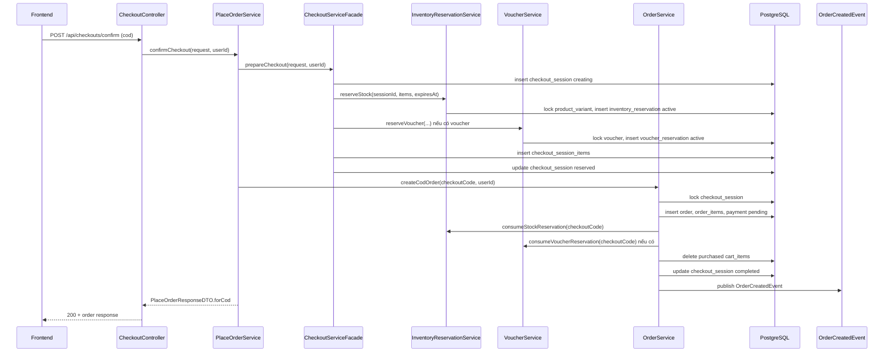
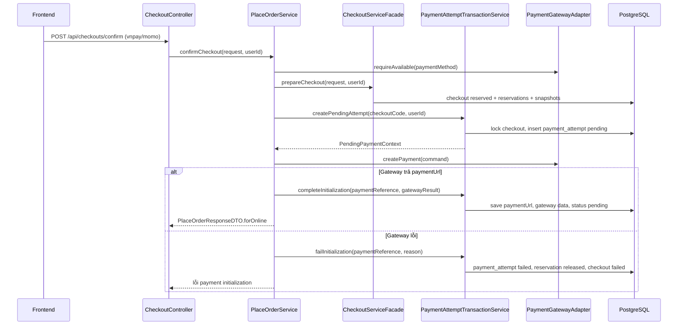

# Báo cáo hoàn thiện chức năng Place Order trước khi tích hợp VNPay

## 4.1. Tổng quan

Báo cáo này tổng hợp trạng thái triển khai chức năng Place Order trên nhánh `feat/place-order` trước khi tích hợp VNPay sandbox thật. Nội dung được đối chiếu từ code hiện tại, schema, repository, service, controller, test và lịch sử commit gần nhất.

Trạng thái Git trước khi tạo báo cáo:

- Nhánh hiện tại: `feat/place-order`.
- Worktree trước khi tạo báo cáo: sạch.
- Commit mới nhất: `1371d72 test(checkout): add postgres integration and concurrency coverage`.

Các commit chính theo lịch sử gần nhất:

| Commit | Nội dung |
| --- | --- |
| `1371d72` | Thêm PostgreSQL integration và concurrency coverage |
| `6356e0e` | Expire reservation và publish order event |
| `66caae1` | Thêm orchestration API cho place order |
| `098350a` | Khởi tạo online payment attempt |
| `ab00105` | Tạo COD order từ checkout |
| `8c5977d` | Chuẩn bị checkout session ở trạng thái reserved |
| `a95784d` | Implement voucher reservation |
| `22e6cf0` | Implement inventory reservation |
| `fd8c66e` | Build checkout snapshot |
| `8e69ada` | Thêm checkout schema patch |
| `acb6018` | Thêm checkout persistence entities |
| `9d670be` | Thêm checkout reservation schema |
| `7f76e56` | Thêm tài liệu thiết kế place-order và payment |

## 4.2. Phạm vi đã triển khai

Đã triển khai nền Place Order theo các nhóm chính:

- Checkout snapshot từ cart và address.
- Checkout session độc lập với địa chỉ/cart sau thời điểm xác nhận.
- Inventory reservation, voucher reservation và TTL reservation.
- Luồng COD: tạo order, order item, payment COD, consume reservation, xóa cart item đã mua.
- Luồng online foundation: tạo `payment_attempt`, commit pending attempt trước gateway call, release reservation khi gateway fail.
- API `POST /api/checkouts/confirm`.
- Cleanup checkout/reservation/payment attempt hết hạn.
- Event `OrderCreatedEvent` sau commit.
- Unit test và PostgreSQL integration/concurrency test nền.

Chưa triển khai:

- Sinh URL VNPay sandbox có chữ ký thật.
- Callback/IPN VNPay.
- Xác nhận payment online thành công/thất bại từ gateway.
- Refund/reconciliation thực tế.
- Email/thông báo đơn hàng thật sau event.

## 4.3. Kiến trúc và pattern

Các pattern/chia lớp chính:

- Controller: `CheckoutController` nhận API confirm checkout.
- Service orchestration: `PlaceOrderServiceImpl` điều phối COD/online.
- Facade: `CheckoutServiceFacade` gom luồng chuẩn bị checkout session reserved.
- Reservation services: `InventoryReservationServiceImpl`, `VoucherReservationServiceImpl`.
- Internal transaction services: `PaymentAttemptTransactionService`, `CheckoutFailureTransactionService`.
- Adapter/Factory: `PaymentGatewayAdapter`, `PaymentGatewayAdapterFactory`, `VnPayAdapter`, `MomoAdapter`.
- Observer/Event: `OrderCreatedEvent`, `OrderCreatedEventListener`.
- Scheduler: `CheckoutExpirationScheduler` gọi `CheckoutExpirationService`.

Luồng được tách theo transaction boundary thay vì dồn toàn bộ vào controller. Controller chỉ lấy user hiện tại từ `Authentication` qua `AuthenticatedUserProvider`, sau đó gọi `PlaceOrderService`.

## 4.4. Database và domain model

Project dùng PostgreSQL, native enum và Hibernate/JPA. Schema chính nằm ở:

- `src/main/resources/db/database_schema.sql`.
- `src/main/resources/db/phase1_checkout_schema_patch.sql`.

Các enum nghiệp vụ đang dùng lowercase:

- `PaymentMethod`: `cod`, `vnpay`, `momo`.
- `CheckoutSessionStatus`: `creating`, `reserved`, `completed`, `failed`, `expired`, `released`.
- `ReservationStatus`: `active`, `consumed`, `released`, `expired`.
- `PaymentAttemptStatus`: `pending`, `completed`, `failed`, `expired`, `requires_refund`, `refund_requested`, `refunded`.
- `OrderStatus`: `pending`, `processing`, `shipping`, `completed`, `cancelled`.
- `PaymentStatus`: `pending`, `completed`, `failed`, `refunded`.

Các entity chính:

- `CheckoutSession`: giữ checkout code, user, shipping snapshot, subtotal, shipping fee, discount, total, voucher, payment method, status, expiresAt.
- `CheckoutSessionItem`: giữ snapshot item tại thời điểm checkout, có liên kết `ProductVariant`.
- `InventoryReservation`: giữ lượng hàng được reserve theo checkout session và product variant.
- `VoucherReservation`: giữ voucher và discount đã reserve theo checkout session.
- `PaymentAttempt`: giữ lần khởi tạo thanh toán online, payment reference, URL, payload gateway và status.
- `Order`, `OrderItem`, `Payment`: dùng cho đơn hàng đã tạo và thanh toán COD/pending.

Các entity enum nhạy với PostgreSQL native enum đã dùng `@JdbcTypeCode(SqlTypes.NAMED_ENUM)` để tránh lỗi cast `varchar` sang enum PostgreSQL.

## 4.5. Luồng COD

Luồng COD đi qua `PlaceOrderServiceImpl.confirmCheckout`:

1. Validate request và payment method.
2. `CheckoutServiceFacade.prepareCheckout` tạo checkout session `reserved`.
3. `OrderServiceImpl.createCodOrder` lock checkout theo `checkoutCode`.
4. Validate checkout thuộc user, method là `cod`, status là `reserved`, chưa hết hạn.
5. Tạo `Order`, `OrderItem`, `Payment` với method `cod`, status `pending`.
6. Consume inventory reservation, consume voucher reservation nếu có.
7. Xóa cart item đã mua.
8. Chuyển checkout session sang `completed`.
9. Publish `OrderCreatedEvent`.



## 4.6. Luồng online payment foundation

Luồng online hiện mới là foundation trước VNPay/MoMo thật:

1. `PlaceOrderServiceImpl` preflight gateway bằng `PaymentGatewayAdapterFactory.requireAvailable`.
2. `CheckoutServiceFacade.prepareCheckout` tạo checkout reserved như COD.
3. `PaymentInitializationServiceImpl.initializeOnlinePayment` gọi `PaymentAttemptTransactionService.createPendingAttempt`.
4. Pending payment attempt được tạo trong transaction riêng trước khi gọi gateway.
5. Adapter được gọi ngoài transaction tạo pending attempt.
6. Nếu gateway trả URL hợp lệ, `completeInitialization` lưu payment URL, gateway transaction id và payload đã sanitize.
7. Nếu gateway lỗi, `failInitialization` chuyển attempt `failed`, release inventory/voucher và checkout `failed`.

`VnPayAdapter` và `MomoAdapter` hiện có class adapter nhưng chưa tạo URL sandbox thật; `isAvailable()` chỉ khả dụng khi cấu hình đủ, và `createPayment` vẫn ném lỗi chưa triển khai signed gateway configuration.



## 4.7. Transaction, lock và concurrency

Transaction boundary chính:

- `CheckoutServiceFacade.prepareCheckout`: đọc checkout data, tạo checkout session, reserve inventory/voucher, lưu snapshot, chuyển `reserved`.
- `OrderServiceImpl.createCodOrder`: tạo order/payment, consume reservation, xóa cart, chuyển checkout `completed`.
- `PaymentAttemptTransactionService`: tách các transaction cho pending attempt, complete initialization, fail initialization.
- `CheckoutExpirationServiceImpl.expireDueCheckouts`: expire checkout/reservation/payment attempt quá hạn.
- `CheckoutFailureTransactionService.failAndReleaseReservedCheckout`: compensation cho COD khi lỗi sau prepare checkout.

Lock chính:

- `CheckoutSessionRepository.findByIdForUpdate`, `findByCheckoutCodeForUpdate`, `findExpiredForUpdate`.
- `ProductVariantRepository.findAllByIdInForUpdate`, lock theo danh sách variant đã sort.
- `VoucherRepository.findByCodeForUpdate`, `findByIdForUpdate`.
- `InventoryReservationRepository.findAllByCheckoutSessionIdForUpdate`.
- `VoucherReservationRepository.findByCheckoutSessionIdForUpdate`.
- `PaymentAttemptRepository.findByPaymentReferenceForUpdate`, `findAllByCheckoutSessionIdForUpdate`.

Inventory reservation không trừ stock ngay. Stock chỉ bị trừ ở bước consume COD. Voucher reservation không tăng `timesUsed` ngay. `timesUsed` chỉ tăng ở bước consume.

## 4.8. Công thức tiền và snapshot

Checkout data:

- Unit price lấy từ `Product.salePrice` nếu có, ngược lại `Product.basePrice + ProductVariant.additionalPrice`.
- Item subtotal = `unitPrice * quantity`.
- Checkout subtotal = tổng item subtotal.
- Shipping fee hiện là `BigDecimal.ZERO`.

Checkout reserved:

- Initial total = `subtotal + shippingFee`.
- Discount = kết quả `VoucherService.reserveVoucher`, hoặc `BigDecimal.ZERO`.
- Final total = `subtotal + shippingFee - discountAmount`.
- Facade validate amount không null, không âm; discount không vượt subtotal.

Snapshot:

- Address snapshot được lưu vào `CheckoutSession.shippingName`, `shippingPhone`, `shippingProvince`, `shippingDistrict`, `shippingWard`, `shippingAddress`.
- Item snapshot được lưu vào `CheckoutSessionItem.productName`, `variantInfo`, `quantity`, `unitPrice`, `subtotal`.
- Không query lại giá sản phẩm trong bước lưu item snapshot; chỉ dùng `EntityManager.getReference(ProductVariant.class, id)` cho liên kết bắt buộc.

## 4.9. API confirm checkout

Endpoint đã có:

- Method: `POST`.
- Path: `/api/checkouts/confirm`.
- Request DTO: `ConfirmCheckoutRequestDTO(addressId, voucherCode, paymentMethod)`.
- Authentication: lấy email từ `Authentication.getName()`, tìm user bằng `UserRepository.findByEmail`, sau đó dùng user id.
- Response success: `ApiResponse` status body `200`, message `Confirm checkout successfully`, data `PlaceOrderResponseDTO`.

Error handling đã trả HTTP status thật qua `GlobalExceptionHandling`:

- `400`: validation, illegal argument, insufficient stock.
- `404`: resource not found.
- `409`: invalid/conflict data.
- `503`: payment gateway unavailable.
- `403`: access denied.
- `401`: authentication error.

## 4.10. Cleanup và expiration

`CheckoutExpirationScheduler` chạy theo property:

- `checkout.cleanup.enabled`, mặc định bật.
- `checkout.cleanup.fixed-delay-ms`, mặc định `60000`.

`CheckoutExpirationServiceImpl.expireDueCheckouts(now)`:

- Lock checkout có status `creating` hoặc `reserved`, `expiresAt <= now`.
- Chuyển active inventory reservation sang `expired`.
- Chuyển active voucher reservation sang `expired`.
- Chuyển pending payment attempt sang `expired`.
- Chuyển checkout session sang `expired`.

Cleanup không trừ stock, không tăng voucher `timesUsed`, không tạo order, không gọi gateway.

## 4.11. Event và notification

Đã có `OrderCreatedEvent` với các field:

- `orderId`.
- `orderCode`.
- `userId`.
- `totalAmount`.
- `occurredAt`.

`OrderServiceImpl` publish event sau khi order COD được tạo. `OrderCreatedEventListener` dùng `@TransactionalEventListener(phase = TransactionPhase.AFTER_COMMIT)` và hiện chỉ log thông tin order. Email/thông báo đơn hàng thật chưa được tích hợp vào event này.

## 4.12. Unit test

Các test liên quan đã có:

- `CheckoutDataServiceImplTest`.
- `InventoryReservationServiceImplTest`.
- `VoucherReservationServiceImplTest`.
- `CheckoutServiceFacadeTest`.
- `OrderServiceImplTest`.
- `PaymentInitializationServiceImplTest`.
- `PaymentAttemptTransactionServiceTest`.
- `PaymentGatewayAdapterFactoryTest`.
- `PlaceOrderServiceImplTest`.
- `CheckoutFailureTransactionServiceTest`.
- `CheckoutControllerTest`.
- `CheckoutExpirationServiceImplTest`.
- `CheckoutExpirationSchedulerTest`.
- `OrderCreatedEventListenerTest`.

Số lượng `@Test` trong các package service/controller/pattern/scheduler/event theo `rg`: 323. Đây là số đếm tĩnh từ source test, không phải kết quả chạy pass/fail.

## 4.13. PostgreSQL integration và concurrency test

Hạ tầng integration:

- `AbstractPostgresIntegrationTest` dùng `PostgreSQLContainer("postgres:16-alpine")`.
- Schema được init thủ công từ `db/database_schema.sql` và `db/phase1_checkout_schema_patch.sql`.
- Có splitter SQL hỗ trợ PostgreSQL dollar quote.
- Tắt Spring SQL initializer bằng `spring.sql.init.mode=never`.
- Dùng `ddl-auto=validate`.
- Cleanup trước mỗi test bằng `src/test/resources/db/cleanup_place_order.sql`.
- Integration profile dùng `maven-failsafe-plugin`, include `**/*IT.java`.

Integration test hiện có:

- `PlaceOrderCodIT`.
- `InventoryReservationConcurrencyIT`.
- `CodOrderConcurrencyIT`.
- `CodOrderRollbackIT`.
- `OnlinePaymentInitializationIT`.
- `CheckoutExpirationIT`.
- `OrderCreatedEventIT`.

Số lượng `@Test` trong package integration theo `rg`: 9. Đây là số đếm tĩnh từ source test, không phải kết quả chạy pass/fail.

Các vùng được cover:

- COD order end-to-end trên PostgreSQL.
- Reservation concurrency cho inventory.
- Concurrent COD order cùng checkout chỉ tạo một order.
- Rollback khi consume voucher lỗi.
- Online payment pending attempt được commit trước gateway call.
- Gateway fail release reservation và mark checkout failed.
- Checkout expiration.
- Event order created sau commit.

## 4.14. Bug đã phát hiện và đã sửa trong quá trình triển khai

Các lỗi/điểm lệch đã được xử lý trong các phase trước:

- Testcontainers artifact id cũ không tương thích dependency management Spring Boot 4; đã đổi sang `testcontainers-junit-jupiter` và `testcontainers-postgresql`.
- Integration test ban đầu lệch schema vì không dùng đúng `database_schema.sql`; đã init schema thủ công theo schema thật.
- SQL splitter ban đầu chưa phù hợp PostgreSQL dollar quote; đã thêm xử lý dollar quote.
- Native PostgreSQL enum gây lỗi insert `varchar` vào enum column; đã map enum bằng `@JdbcTypeCode(SqlTypes.NAMED_ENUM)`.
- Test context dùng container lifecycle chưa ổn định, gây lỗi mở EntityManager/transaction sau khi container dừng; đã dùng static container start thủ công trong `DynamicPropertySource`.
- `GlobalExceptionHandling` trước đó trả body status lỗi nhưng HTTP status vẫn 200; đã trả HTTP status thật và cập nhật controller test kỳ vọng lỗi.
- Compile lỗi lambda capture biến `checkoutSession` bị reassign; đã tách `savedCheckoutSession` và `reservedCheckoutSession`.

## 4.15. File quan trọng

Production:

- `src/main/java/vn/hcmute/edu/dp/nhom10/backend/controller/CheckoutController.java`.
- `src/main/java/vn/hcmute/edu/dp/nhom10/backend/service/impl/PlaceOrderServiceImpl.java`.
- `src/main/java/vn/hcmute/edu/dp/nhom10/backend/pattern/facade/checkout/CheckoutServiceFacade.java`.
- `src/main/java/vn/hcmute/edu/dp/nhom10/backend/service/impl/OrderServiceImpl.java`.
- `src/main/java/vn/hcmute/edu/dp/nhom10/backend/service/impl/PaymentInitializationServiceImpl.java`.
- `src/main/java/vn/hcmute/edu/dp/nhom10/backend/service/internal/PaymentAttemptTransactionService.java`.
- `src/main/java/vn/hcmute/edu/dp/nhom10/backend/service/internal/CheckoutFailureTransactionService.java`.
- `src/main/java/vn/hcmute/edu/dp/nhom10/backend/pattern/reservation/inventory/InventoryReservationServiceImpl.java`.
- `src/main/java/vn/hcmute/edu/dp/nhom10/backend/pattern/reservation/voucher/VoucherReservationServiceImpl.java`.
- `src/main/java/vn/hcmute/edu/dp/nhom10/backend/service/impl/CheckoutExpirationServiceImpl.java`.
- `src/main/java/vn/hcmute/edu/dp/nhom10/backend/scheduler/CheckoutExpirationScheduler.java`.
- `src/main/java/vn/hcmute/edu/dp/nhom10/backend/pattern/adapter/payment/PaymentGatewayAdapterFactory.java`.
- `src/main/java/vn/hcmute/edu/dp/nhom10/backend/pattern/adapter/payment/VnPayAdapter.java`.
- `src/main/java/vn/hcmute/edu/dp/nhom10/backend/pattern/adapter/payment/MomoAdapter.java`.

Schema/config:

- `src/main/resources/db/database_schema.sql`.
- `src/main/resources/db/phase1_checkout_schema_patch.sql`.
- `src/main/resources/application.yml`.
- `src/main/resources/application-dev.yml`.
- `src/main/resources/application-test.yml`.
- `pom.xml`.

Test:

- `src/test/java/vn/hcmute/edu/dp/nhom10/backend/integration/AbstractPostgresIntegrationTest.java`.
- `src/test/java/vn/hcmute/edu/dp/nhom10/backend/integration/support/PlaceOrderTestDataFactory.java`.
- Các unit/integration test liệt kê ở mục 4.12 và 4.13.

## 4.16. Lịch sử phase

Theo commit history, các phase đã được hoàn thiện theo thứ tự:

1. Thiết kế tài liệu place-order/payment.
2. Checkout reservation schema.
3. Checkout persistence entities.
4. Checkout schema patch cho database hiện có.
5. Checkout snapshot.
6. Inventory reservation.
7. Voucher reservation.
8. Prepare reserved checkout.
9. COD order creation.
10. Online payment attempt initialization.
11. Place order orchestration API.
12. Expiration cleanup và order event.
13. PostgreSQL integration/concurrency coverage.

## 4.17. Checklist hoàn thiện hiện tại

| Hạng mục | Trạng thái |
| --- | --- |
| Checkout snapshot từ cart/address | Đã có |
| Checkout session reserved | Đã có |
| Inventory reservation | Đã có |
| Voucher reservation | Đã có |
| COD order creation | Đã có |
| Payment COD pending | Đã có |
| Online payment attempt foundation | Đã có |
| Adapter factory cho online gateway | Đã có |
| API confirm checkout | Đã có |
| HTTP error status thật | Đã có |
| Cleanup reservation hết hạn | Đã có |
| Order created event sau commit | Đã có |
| PostgreSQL integration/concurrency test source | Đã có |
| VNPay signed sandbox URL | Chưa có |
| VNPay return/callback/IPN | Chưa có |
| Consume online payment thành công | Chưa có |
| Refund/reconciliation online | Chưa có |
| Notification đơn hàng thật | Chưa có |

## 4.18. Rủi ro còn lại

- VNPay adapter hiện chưa ký tham số và chưa sinh URL sandbox thật.
- Chưa có callback/IPN nên online order chưa chuyển sang trạng thái hoàn tất sau thanh toán.
- Cần thiết kế idempotency cho callback/IPN và double submit từ frontend.
- Cần xác định cách tạo order online: tạo order sau payment success hay tạo order pending trước payment callback.
- Cần xác minh bảo mật payload gateway: chữ ký, return URL, callback URL, amount, order info.
- Cần xác minh quy tắc hết hạn payment attempt so với TTL checkout khi user đang ở gateway.
- Scheduler cleanup hiện chạy theo fixed delay; chưa thấy batch size cấu hình.
- Event order created hiện chỉ log, chưa gửi email/thông báo thật.
- Chưa xác minh hiệu năng query dưới tải thật ngoài các integration/concurrency test hiện có.

## 4.19. Mức sẵn sàng trước khi tích hợp VNPay

Place Order hiện đã sẵn sàng về nền transaction và domain cho COD, reservation và online payment initialization. Phần còn thiếu để tích hợp VNPay sandbox nằm chủ yếu ở adapter và callback/IPN:

- Cần thêm cấu hình VNPay sandbox: terminal code, secret/hash key, pay URL, return URL, IPN/callback URL.
- Cần implement `VnPayAdapter.createPayment` để sinh URL có chữ ký.
- Cần endpoint return/callback/IPN, verify signature và mapping transaction status.
- Cần service hoàn tất payment online: mark attempt completed, consume reservation, tạo/cập nhật order/payment tùy flow được chọn.
- Cần xử lý duplicate callback, callback đến sau khi checkout expired, amount mismatch và signature mismatch.

Không nên sửa luồng COD khi tích hợp VNPay, trừ khi cần tái sử dụng chung mapping order/payment cho online success.

## 4.20. Kết quả kiểm tra trong lượt tạo báo cáo

Các lệnh đã chạy:

- `git branch --show-current`: `feat/place-order`.
- `git status --short --branch`: sạch trước khi tạo báo cáo.
- `git log --oneline --decorate -30`: đã đọc lịch sử phase.
- `git diff --check`: pass trước khi tạo báo cáo.
- `mvn clean test`: chưa xác minh được do môi trường không tải được parent POM từ Maven Central.
- `mvn clean verify -Pintegration`: chưa xác minh được do cùng lỗi môi trường.

Lỗi Maven trong môi trường Codex:

```text
Non-resolvable parent POM ... org.springframework.boot:spring-boot-starter-parent:pom:4.0.6
Could not transfer artifact ... from/to central (https://repo.maven.apache.org/maven2): Permission denied
```

Kết luận kiểm tra: chưa thể xác minh pass/fail test trong môi trường Codex vì lỗi môi trường dependency, không phải bằng chứng source code lỗi. Cần chạy lại trên máy có quyền truy cập Maven Central/cache Maven đầy đủ:

```powershell
mvn clean test
mvn clean verify -Pintegration
```

## 4.21. Kế hoạch tiếp theo cho VNPay sandbox

Đề xuất phase tiếp theo:

1. Thêm cấu hình VNPay sandbox tối thiểu bằng property/env, không hard-code secret.
2. Implement `VnPayAdapter.createPayment` với URL encode, sort params, HMAC/signature đúng tài liệu VNPay.
3. Tạo DTO/parser cho VNPay return và IPN.
4. Tạo endpoint callback/IPN và verify signature.
5. Thêm transaction service xử lý payment success/failure idempotent.
6. Quyết định flow online order: tạo order khi callback success, hoặc tạo order pending trước rồi cập nhật payment.
7. Thêm unit test cho signing, callback verification, idempotency và amount mismatch.
8. Thêm PostgreSQL integration test cho online success/failure callback.
9. Chạy lại `mvn clean test` và `mvn clean verify -Pintegration`.

Commit message đề xuất cho báo cáo này:

```text
docs(checkout): summarize place order implementation
```
