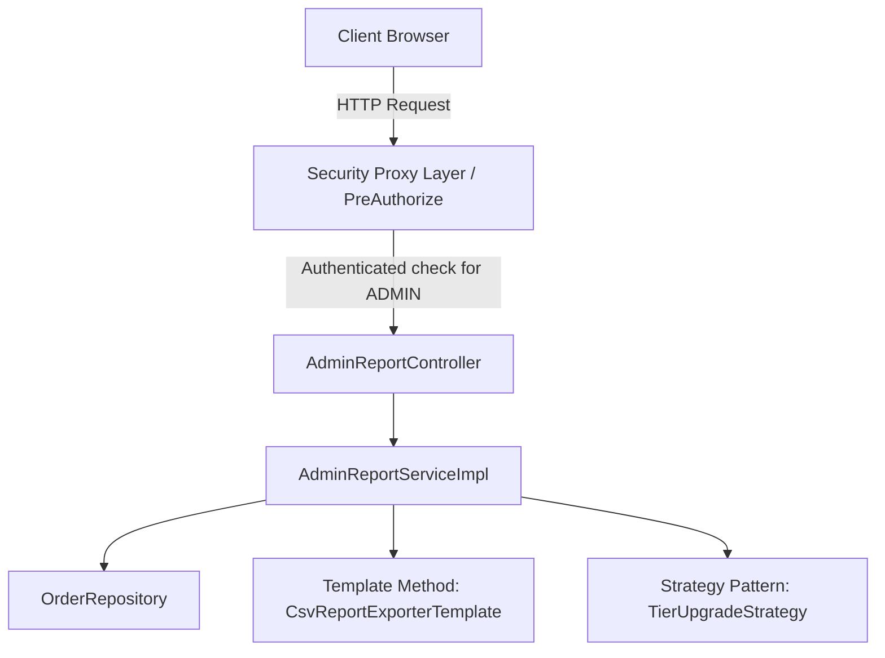
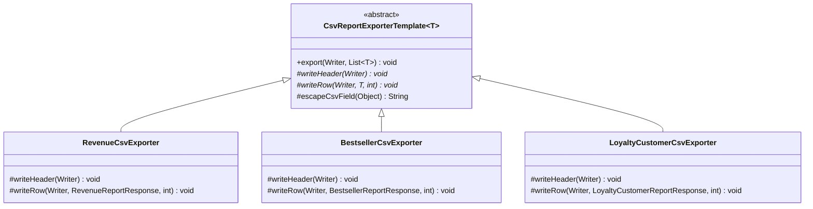
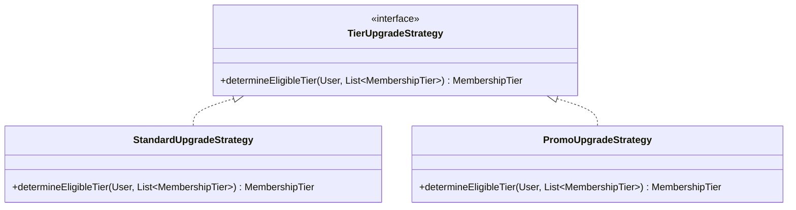
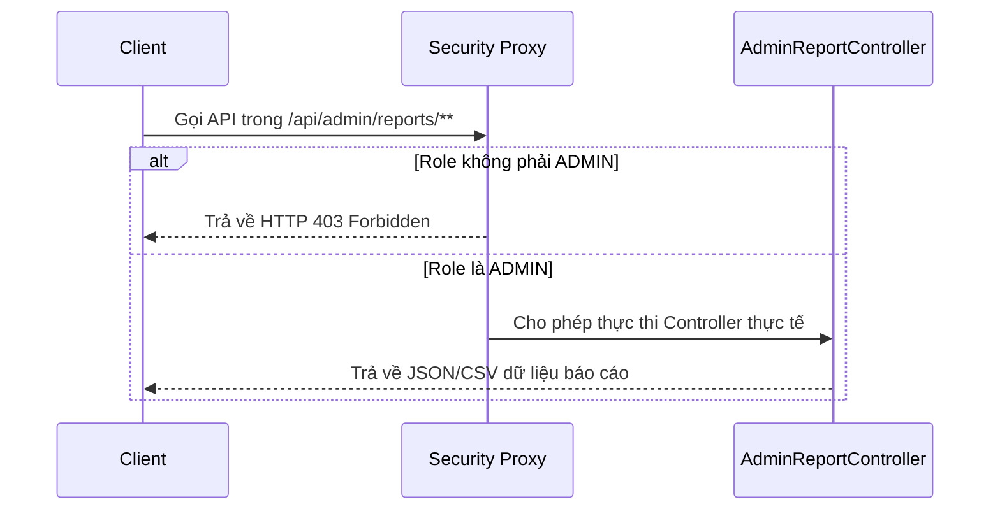

# TÀI LIỆU THIẾT KẾ: CÁC DESIGN PATTERNS ÁP DỤNG TRONG PHÂN HỆ BÁO CÁO (ADMIN-REPORT)

Tài liệu này trình bày các mẫu thiết kế phần mềm (**Design Patterns**) được áp dụng trong phân hệ **Báo cáo & Thống kê dành cho Admin** trên nhánh `feature/admin-reports`. Thiết kế này nhằm giải quyết các bài toán về tính mở rộng, khả năng bảo trì và tách biệt rõ ràng trách nhiệm hệ thống (Separation of Concerns).

---

## I. TỔNG QUAN KIẾN TRÚC PHÂN HỆ BÁO CÁO

Kiến trúc phân hệ báo cáo tuân thủ mô hình phân tầng chuẩn kết hợp linh hoạt với các mẫu thiết kế để đảm bảo:
1. **Security**: Các báo cáo nhạy cảm được bảo mật ở mức API.
2. **Extensibility**: Có thể dễ dàng bổ sung định dạng xuất báo cáo (Excel, PDF) hoặc chính sách nâng hạng khách hàng mà không ảnh hưởng tới code cũ.
3. **Performance**: Tính toán gom nhóm tối ưu ở mức Database và stream dữ liệu trực tiếp dưới dạng CSV.



---

## II. BẢNG MA TRẬN ÁP DỤNG DESIGN PATTERNS

| Tên Design Pattern | Vị trí áp dụng | Vai trò & Giá trị mang lại |
| :--- | :--- | :--- |
| **Template Method Pattern** | Lớp `CsvReportExporterTemplate` và các lớp con kế thừa | Định nghĩa bộ khung thuật toán kết xuất CSV dùng chung, kiểm soát quy trình mở/ghi BOM/flush/đóng luồng và ép kiểu dữ liệu đặc biệt. Lớp con chỉ cần định nghĩa cách ghi Header và ghi Row. |
| **Strategy Pattern** | Lớp `TierUpgradeStrategy` và các concrete strategies | Cách ly thuật toán phân hạng thành viên (`MembershipTier`) khỏi thực thể `User`. Giúp hoán đổi linh hoạt giữa chính sách nâng hạng tiêu chuẩn và chính sách ưu đãi trong các chiến dịch sự kiện. |
| **Proxy Pattern** | Chú thích `@PreAuthorize` ở Controller Layer | Sử dụng Spring Security AOP Proxy để kiểm soát quyền truy cập ở mức lớp, chỉ cho phép vai trò `ADMIN` truy cập vào toàn bộ phân hệ báo cáo thống kê (BM1, BM2, BM5). |
| **DTO Pattern** | Các Response Record trong gói `dto/response/` | Đóng gói dữ liệu báo cáo từ DB để chuyển về Client dưới dạng bất biến (immutable), tối ưu hóa serialization và cô lập dữ liệu nhạy cảm. |

---

## III. CHI TIẾT THIẾT KẾ VÀ CODE KHUNG (SKELETON CODE)

### 1. Template Method Pattern (Kết xuất CSV báo cáo - BM1, BM2, BM5)

#### Thiết kế cấu trúc lớp (Class Diagram)


#### Code Khung Thiết Kế
* Lớp trừu tượng `CsvReportExporterTemplate` quản lý cấu trúc quy trình ghi file CSV:
```java
public abstract class CsvReportExporterTemplate<T> {
    // Quy trình thuật toán cố định (Template Method)
    public final void export(Writer writer, List<T> data) throws IOException {
        writer.write('\uFEFF'); // 1. Ghi UTF-8 BOM
        writeHeader(writer);    // 2. Ghi Header (Lớp con triển khai)
        if (data != null && !data.isEmpty()) {
            for (int i = 0; i < data.size(); i++) {
                writeRow(writer, data.get(i), i + 1); // 3. Ghi dòng dữ liệu (Lớp con triển khai)
            }
        }
        writer.flush();
    }
    protected abstract void writeHeader(Writer writer) throws IOException;
    protected abstract void writeRow(Writer writer, T item, int index) throws IOException;
    
    // Thuật toán dùng chung xử lý dữ liệu chống lệch cột CSV
    protected String escapeCsvField(Object value) { ... }
}
```

---

### 2. Strategy Pattern (Chính sách thăng hạng thành viên - NV.14)

#### Thiết kế cấu trúc lớp (Class Diagram)


#### Code Khung Thiết Kế
* Interface `TierUpgradeStrategy` thiết lập khuôn mẫu chính sách thăng hạng:
```java
public interface TierUpgradeStrategy {
    MembershipTier determineEligibleTier(User user, List<MembershipTier> allTiers);
}
```
* Bằng cách áp dụng Strategy, hệ thống dễ dàng cấu hình hoặc thay đổi chiến lược nâng hạng tại Runtime:
```java
// Trong Service Layer điều phối chính sách
TierUpgradeStrategy strategy = isHolidaySeason ? new PromoUpgradeStrategy() : new StandardUpgradeStrategy();
MembershipTier eligibleTier = strategy.determineEligibleTier(user, allTiers);
```

---

### 3. Proxy Pattern (Security AOP Proxy - Phân quyền hệ thống)

#### Cơ chế hoạt động
Spring Security áp dụng mô hình Proxy động để bảo vệ tài nguyên. Dựa theo tài liệu đặc tả `Nhom10_FinalProject1.md` (Bảng 3.1 & 3.2), toàn bộ phân hệ báo cáo thống kê kết xuất BM1, BM2, BM5 đều được gán duy nhất cho **Quản trị viên (Admin)**. Nhân viên (Staff) không có quyền hạn này. Do đó, Proxy bảo mật được thiết lập ở mức lớp.



#### Cấu hình mã nguồn mẫu
```java
@RestController
@RequestMapping("/api/admin/reports")
@PreAuthorize("hasRole('ADMIN')") // Security Proxy Pattern ở mức Class
public class AdminReportController {
    // Toàn bộ các endpoints thống kê bên trong tự động kế thừa bộ lọc Proxy này
}
```

---

### 4. DTO Pattern (Java Records & Constructor bảo mật)

#### Vai trò thiết kế
* Đóng gói dữ liệu kết xuất từ câu truy vấn JPA gộp nhóm trong Database, không để lộ cấu trúc Entity vật lý của hệ thống ra ngoài.
* Triển khai Compact Constructor trong Java Record để làm sạch dữ liệu gộp nhóm (tự động quy đổi các giá trị `null` thành số `0` hoặc `BigDecimal.ZERO` trước khi serialization để tránh lỗi `NullPointerException` ở Frontend).

#### Ví dụ thiết kế `RevenueReportResponse`:
```java
public record RevenueReportResponse(
        Date date,
        Long totalOrders,
        Long completedOrders,
        Long cancelledOrders,
        BigDecimal totalRevenue,
        BigDecimal totalDiscounts,
        BigDecimal netRevenue
) {
    // Compact Constructor xử lý làm sạch dữ liệu
    public RevenueReportResponse {
        if (totalOrders == null) totalOrders = 0L;
        if (completedOrders == null) completedOrders = 0L;
        if (cancelledOrders == null) cancelledOrders = 0L;
        if (totalRevenue == null) totalRevenue = BigDecimal.ZERO;
        if (totalDiscounts == null) totalDiscounts = BigDecimal.ZERO;
        if (netRevenue == null) netRevenue = BigDecimal.ZERO;
    }
}
```