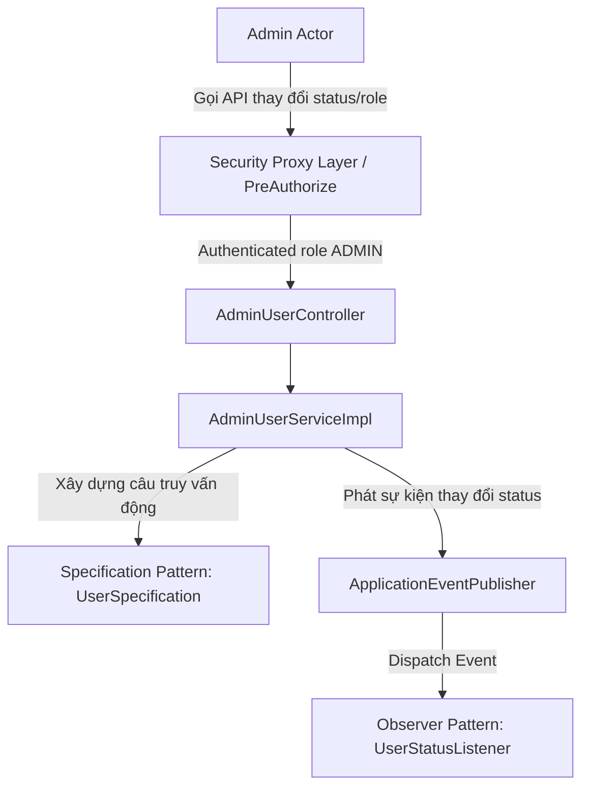
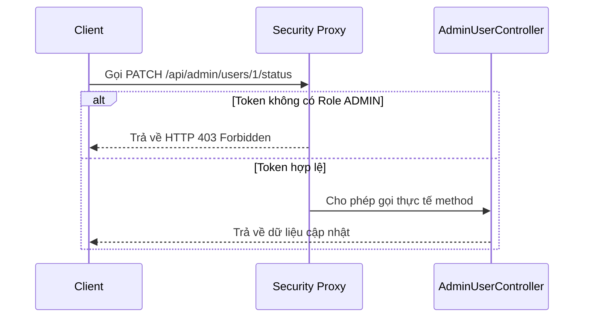
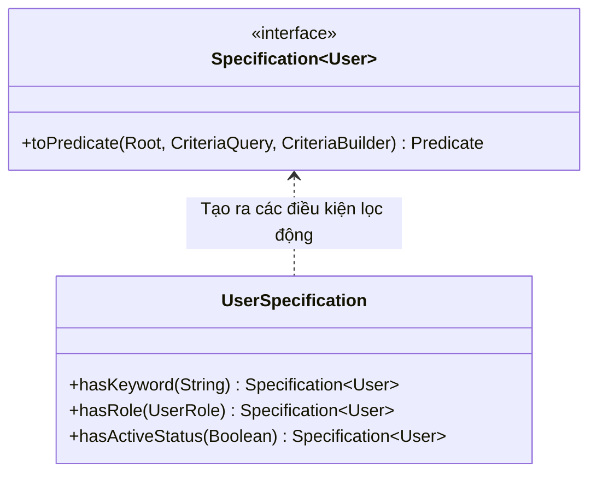
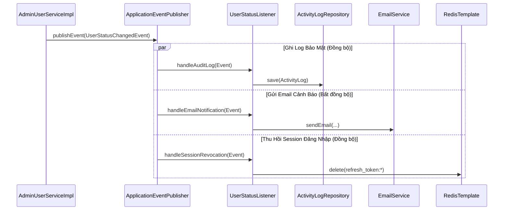

# TÀI LIỆU THIẾT KẾ: CÁC DESIGN PATTERNS ÁP DỤNG TRONG QUẢN LÝ USER (ADMIN-USER)

Tài liệu này trình bày các mẫu thiết kế phần mềm (**Design Patterns**) được áp dụng trong phân hệ **Quản lý Người dùng dành cho Admin/Staff** trên nhánh `feature/admin-user-management`. Thiết kế này đảm bảo tính bảo mật hệ thống, khả năng mở rộng bộ lọc tìm kiếm và đồng bộ hóa các tác vụ phụ trợ.

---

## I. TỔNG QUAN KIẾN TRÚC PHÂN HỆ QUẢN LÝ USER

Kiến trúc quản lý User sử dụng cơ chế bảo mật phân quyền, tìm kiếm động bằng Specification và xử lý sự kiện bất đồng bộ qua mô hình Pub/Sub nội bộ:



---

## II. BẢNG MA TRẬN ÁP DỤNG DESIGN PATTERNS

| Tên Design Pattern | Vị trí áp dụng | Vai trò & Giá trị mang lại |
| :--- | :--- | :--- |
| **Proxy Pattern** | Chú thích `@PreAuthorize` ở Controller Layer | Sử dụng Spring Security AOP Proxy để chặn và xác thực quyền `ADMIN` của token trước khi đi vào hàm nghiệp vụ chính. |
| **Specification Pattern** | Lớp `UserSpecification` và `JpaSpecificationExecutor` | Xây dựng câu truy vấn động cho bộ lọc tìm kiếm nâng cao (lọc theo từ khóa, trạng thái hoạt động, vai trò). Dễ dàng kết nối thêm tiêu chí lọc mới mà không làm vỡ các phương thức cũ. |
| **Observer Pattern** | `UserStatusChangedEvent` và `UserStatusListener` | Tách biệt các tác vụ phụ trợ (ghi log bảo mật, gửi mail thông báo, thu hồi session trong Redis) ra khỏi luồng cập nhật trạng thái User chính, giúp luồng chính xử lý nhanh hơn. |
| **DTO Pattern** | `AdminUserResponse` và `UpdateUserRoleRequest` | Tách biệt Entity cơ sở dữ liệu (`User`) ra khỏi API. Che giấu thông tin nhạy cảm (mật khẩu băm) và tối ưu hóa dữ liệu trả về cho Frontend. |

---

## III. CHI TIẾT THIẾT KẾ VÀ CODE KHUNG (SKELETON CODE)

### 1. Proxy Pattern (Bảo mật quyền hạn - AD.1)

#### Cơ chế hoạt động
Spring Security áp dụng mô hình Proxy động để bọc các endpoint quản trị. Khi client gửi request, Proxy sẽ kiểm tra xem User có quyền hạn hợp lệ (`ROLE_ADMIN`) hay không, từ đó trả về `403 Forbidden` ngay lập tức nếu không khớp vai trò.



#### Cấu hình mã nguồn mẫu
```java
@RestController
@RequestMapping("/api/admin/users")
@PreAuthorize("hasRole('ADMIN')") // Security Proxy Pattern ở mức lớp
public class AdminUserController {
    // Tất cả phương thức con bên trong tự động thừa hưởng quyền bảo vệ
}
```

---

### 2. Specification Pattern (Truy vấn động - AD.1 & NV.14)

#### Thiết kế cấu trúc lớp (Class Diagram)


#### Code Khung Thiết Kế
* Lớp `UserSpecification` định nghĩa các tiêu chí lọc nhỏ, độc lập:
```java
public final class UserSpecification {
    public static Specification<User> hasKeyword(String keyword) {
        return (root, query, cb) -> {
            if (keyword == null || keyword.isBlank()) return cb.conjunction();
            String pattern = "%" + keyword.trim().toLowerCase() + "%";
            return cb.or(
                cb.like(cb.lower(root.get("fullName")), pattern),
                cb.like(cb.lower(root.get("email")), pattern)
            );
        };
    }
    public static Specification<User> hasRole(UserRole role) { ... }
    public static Specification<User> hasActiveStatus(Boolean isActive) { ... }
}
```
* Trong Service, các tiêu chí được ghép nối linh hoạt:
```java
Specification<User> spec = Specification.where(UserSpecification.hasKeyword(keyword))
                                        .and(UserSpecification.hasRole(role))
                                        .and(UserSpecification.hasActiveStatus(isActive));
Page<User> users = userRepository.findAll(spec, pageable);
```

---

### 3. Observer Pattern (Lưu vết audit log & Gửi thông báo - AD.1)

#### Luồng hoạt động của sự kiện
Khi trạng thái tài khoản thay đổi (bị khóa hoặc mở khóa), Service Layer phát đi sự kiện `UserStatusChangedEvent`. Lớp `UserStatusListener` lắng nghe sự kiện này để điều phối các công việc phụ trợ.



#### Code Khung Thiết Kế
* **Event (Sự kiện phát đi)**:
```java
public class UserStatusChangedEvent extends ApplicationEvent {
    private final Long userId;
    private final String email;
    private final Boolean newStatus;
    // Constructor và Getters
}
```
* **Listener (Observer - Lắng nghe sự kiện)**:
```java
@Component
public class UserStatusListener {
    
    @EventListener // Ghi log kiểm toán đồng bộ
    public void handleAuditLog(UserStatusChangedEvent event) { ... }

    @Async // Gửi email thông báo bất đồng bộ ngầm tránh block luồng chính
    @EventListener
    public void handleEmailNotification(UserStatusChangedEvent event) { ... }

    @EventListener // Quét và xóa bỏ các refresh token trong Redis khi user bị khóa tài khoản
    public void handleSessionRevocation(UserStatusChangedEvent event) { ... }
}
```
