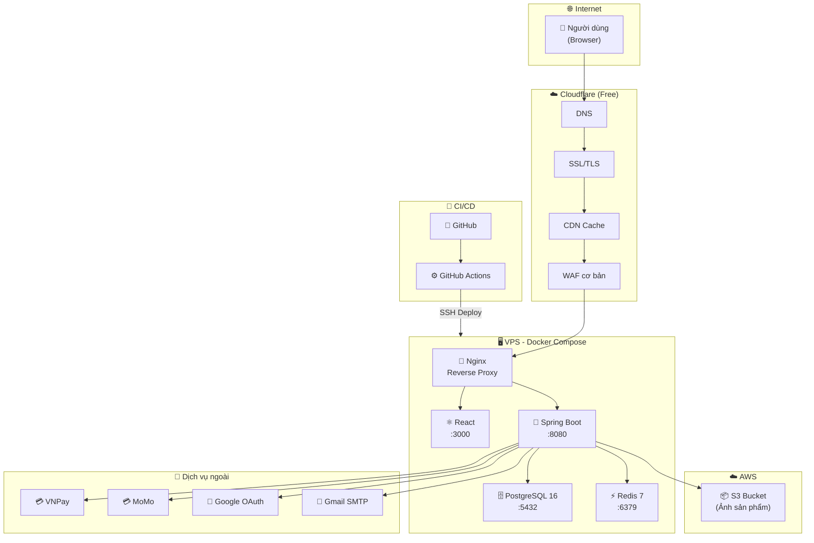

# Thiết kế hạ tầng triển khai — Website Bán Quần Áo

## 1. Tổng quan

Tài liệu này mô tả kiến trúc hạ tầng triển khai cho hệ thống "Website Bán Quần Áo" của Nhóm 10. Thiết kế được xây dựng dựa trên mô hình tham khảo (kiến trúc AWS enterprise-grade) nhưng **đã được điều chỉnh** phù hợp với bối cảnh thực tế:

- **Đối tượng**: Sinh viên, ngân sách hạn chế
- **Tài nguyên cloud**: AWS Free Tier (chủ yếu dùng S3 lưu ảnh sản phẩm)
- **Quy mô dự kiến**: < 1.000 người dùng đồng thời
- **Mục tiêu**: Chi phí tối thiểu (gần $0/tháng), dễ vận hành, đủ chuyên nghiệp cho báo cáo

---

## 2. So sánh: Mô hình tham khảo vs. Thiết kế nhóm

| Thành phần            | Mô hình tham khảo (Enterprise) | Thiết kế nhóm (Student)                | Lý do điều chỉnh                                                  |
| --------------------- | ------------------------------ | -------------------------------------- | ----------------------------------------------------------------- |
| **CDN**               | CloudFront                     | Cloudflare (Free plan)                 | Miễn phí, tích hợp DNS + SSL + CDN                                |
| **Load Balancer**     | AWS ALB                        | Nginx Reverse Proxy                    | ALB tốn ~$16/tháng, Nginx miễn phí                                |
| **Container Runtime** | AWS ECS + ECR                  | Docker Compose trên VPS                | ECS phức tạp và tốn phí, Docker Compose đơn giản hơn cho team nhỏ |
| **Database**          | Amazon RDS PostgreSQL          | PostgreSQL trên VPS (hoặc Neon free)   | RDS tốn phí ngoài free tier 12 tháng đầu                          |
| **Cache**             | Amazon ElastiCache (Redis)     | Redis container trên VPS               | ElastiCache không có free tier                                    |
| **Object Storage**    | S3                             | **S3 (giữ nguyên)**                    | Free tier: 5GB, 20K GET, 2K PUT/tháng — đủ dùng                   |
| **Email Service**     | Amazon SES + SNS               | Gmail SMTP (dev) / Brevo free (prod)   | SES cần verify domain, Brevo cho 300 email/ngày miễn phí          |
| **Message Queue**     | Amazon MSK (Kafka)             | Không cần                              | Quy mô nhỏ, xử lý đồng bộ là đủ                                   |
| **CI/CD**             | AWS CodeBuild                  | GitHub Actions (free)                  | 2.000 phút/tháng miễn phí cho repo private                        |
| **WAF**               | AWS WAF                        | Cloudflare WAF (free tier)             | Bảo vệ cơ bản DDoS + bot miễn phí                                 |
| **Payment**           | Stripe                         | VNPay Sandbox / MoMo Sandbox           | Phù hợp thị trường Việt Nam, có sandbox test miễn phí             |

---

## 3. Sơ đồ kiến trúc hạ tầng

```
┌─────────────────────────────────────────────────────────────────────┐
│                        INTERNET / USERS                            │
│                                                                     │
│            ┌──────────┐              ┌───────────┐                  │
│            │ Browser  │              │  Mobile   │                  │
│            │ (Web)    │              │ (Tương lai)│                  │
│            └────┬─────┘              └─────┬─────┘                  │
│                 │         HTTPS            │                        │
└─────────────────┼──────────────────────────┼────────────────────────┘
                  │                          │
                  ▼                          ▼
    ┌─────────────────────────────────────────────────┐
    │              CLOUDFLARE (Free Plan)              │
    │  ┌──────────┐ ┌──────────┐ ┌──────────────────┐ │
    │  │   DNS    │ │ SSL/TLS  │ │  CDN + WAF cơ bản│ │
    │  └──────────┘ └──────────┘ └──────────────────┘ │
    └──────────────────────┬──────────────────────────┘
                           │
          ┌────────────────┼───────────────────┐
          │ Static Assets  │ API Requests      │
          ▼                ▼                   │
   ┌─────────────┐  ┌──────────────────────────┼──────────────────┐
   │  AWS S3     │  │        VPS (Ubuntu)       │                  │
   │  (Free Tier)│  │     Ví dụ: DigitalOcean   │                  │
   │             │  │     hoặc Oracle Cloud     │                  │
   │ • Ảnh SP    │  │     (Free Tier)           │                  │
   │ • Ảnh review│  │                           │                  │
   │ • Avatar    │  │  ┌─────────────────────┐  │                  │
   │ • Banner    │  │  │   Nginx (Port 80)   │  │                  │
   └─────────────┘  │  │   Reverse Proxy     │  │                  │
                    │  │   + Rate Limiting    │  │                  │
                    │  └──────────┬──────────┘  │                  │
                    │             │              │                  │
                    │     ┌───────┴───────┐     │                  │
                    │     ▼               ▼     │                  │
                    │ ┌────────┐   ┌──────────┐ │                  │
                    │ │Frontend│   │ Backend  │ │                  │
                    │ │  React │   │ Spring   │ │                  │
                    │ │  :3000 │   │ Boot     │ │                  │
                    │ │        │   │ :8080    │ │                  │
                    │ └────────┘   └────┬─────┘ │                  │
                    │                   │       │                  │
                    │          ┌────────┼───────┤                  │
                    │          ▼        ▼       ▼                  │
                    │    ┌────────┐ ┌───────┐ ┌──────────────┐     │
                    │    │Postgre │ │ Redis │ │ Upload → S3  │     │
                    │    │SQL     │ │ :6379 │ │ (AWS SDK)    │     │
                    │    │ :5432  │ │       │ └──────────────┘     │
                    │    │        │ │       │                      │
                    │    │ • SP   │ │ • Sess│                      │
                    │    │ • ĐH   │ │ • Cart│                      │
                    │    │ • KH   │ │ • OTP │                      │
                    │    └────────┘ └───────┘                      │
                    └─────────────────────────────────────────────┘

    ┌─────────────────────────────────────────────────┐
    │             DỊCH VỤ BÊN NGOÀI                   │
    │                                                  │
    │  ┌──────────┐  ┌──────────┐  ┌───────────────┐  │
    │  │  VNPay   │  │  MoMo    │  │ Gmail SMTP /  │  │
    │  │ Sandbox  │  │ Sandbox  │  │ Brevo (email) │  │
    │  └──────────┘  └──────────┘  └───────────────┘  │
    │                                                  │
    │  ┌──────────┐  ┌──────────┐                      │
    │  │ Google   │  │ GitHub   │                      │
    │  │ OAuth 2.0│  │ Actions  │                      │
    │  └──────────┘  └──────────┘                      │
    └─────────────────────────────────────────────────┘
```

---

## 4. Chi tiết từng thành phần

### 4.1. Tầng Client (Người dùng)

| Thành phần             | Mô tả                                                                                    |
| ---------------------- | ---------------------------------------------------------------------------------------- |
| **Web Browser**        | Giao diện chính, hỗ trợ Chrome/Firefox/Safari/Edge. Responsive design (Desktop + Mobile) |
| **Mobile (tương lai)** | Hiện tại chưa phát triển, kiến trúc API-first cho phép mở rộng sau                       |

### 4.2. Tầng Edge — Cloudflare (Free Plan)

| Chức năng          | Chi tiết                                                            |
| ------------------ | ------------------------------------------------------------------- |
| **DNS Management** | Quản lý domain, trỏ về VPS                                          |
| **SSL/TLS**        | Chứng chỉ HTTPS miễn phí (Full Strict mode)                         |
| **CDN**            | Cache static assets (JS, CSS, fonts) tại edge server gần người dùng |
| **WAF cơ bản**     | Chặn bot, DDoS protection layer 3/4, IP filtering                   |
| **Page Rules**     | Cache rules cho static content, redirect HTTP → HTTPS               |

**Chi phí**: $0/tháng

### 4.3. Tầng Lưu trữ tĩnh — AWS S3

| Cấu hình             | Chi tiết                                                                    |
| -------------------- | --------------------------------------------------------------------------- |
| **Bucket**           | `nhom10-clothing-store-assets`                                              |
| **Region**           | `ap-southeast-1` (Singapore — gần Việt Nam)                                 |
| **Cấu trúc thư mục** | `/products/`, `/reviews/`, `/avatars/`, `/banners/`                         |
| **Access Control**   | IAM User với quyền `s3:PutObject`, `s3:GetObject` cho backend               |
| **Public Access**    | Cho phép đọc public qua bucket policy (hoặc Pre-signed URL cho ảnh private) |
| **CORS**             | Cấu hình cho phép upload từ domain frontend                                 |

**Free Tier**: 5 GB storage, 20.000 GET requests, 2.000 PUT requests/tháng — đủ cho giai đoạn phát triển và demo.

### 4.4. Tầng Server — VPS

#### Lựa chọn VPS (chọn 1 trong các phương án sau)

| Phương án                     | Cấu hình                   | Chi phí                    | Ghi chú                       |
| ----------------------------- | -------------------------- | -------------------------- | ----------------------------- |
| **Oracle Cloud Free Tier** ⭐ | 1 OCPU, 1GB RAM, 50GB disk | **$0/tháng** (Always Free) | Khuyến nghị cho sinh viên     |
| **DigitalOcean**              | 1 vCPU, 1GB RAM, 25GB SSD  | ~$6/tháng                  | Có GitHub Student Pack credit |
| **AWS EC2 Free Tier**         | t2.micro, 1GB RAM          | $0/tháng (12 tháng đầu)    | Cùng account với S3           |

#### Docker Compose Stack

Toàn bộ ứng dụng chạy bằng Docker Compose trên 1 VPS duy nhất:

```yaml
# docker-compose.yml (minh họa cấu trúc)
services:
  nginx: # Reverse Proxy + Static serving
    ports: ["80:80", "443:443"]

  frontend: # React/Vite build → Nginx serve
    build: ./frontend

  backend: # Spring Boot API
    build: ./backend
    ports: ["8080:8080"]
    environment:
      - DB_HOST=postgres
      - REDIS_HOST=redis
      - AWS_S3_BUCKET=nhom10-clothing-store-assets

  postgres: # Cơ sở dữ liệu chính
    image: postgres:16-alpine
    ports: ["5432:5432"]
    volumes: ["postgres_data:/var/lib/postgresql/data"]

  redis: # Cache & Session store
    image: redis:7-alpine
    ports: ["6379:6379"]
```

### 4.5. Tầng Ứng dụng

#### 4.5.1. Frontend — React

| Thuộc tính           | Chi tiết                   |
| -------------------- | -------------------------- |
| **Framework**        | React + Vite               |
| **Routing**          | React Router v6            |
| **State Management** | Context API / Zustand      |
| **HTTP Client**      | Axios (gọi API backend)    |
| **Build Output**     | Static files → Nginx serve |

#### 4.5.2. Backend — Spring Boot

| Thuộc tính         | Chi tiết                    |
| ------------------ | --------------------------- |
| **Framework**      | Spring Boot 3.x             |
| **API Style**      | RESTful API (JSON)          |
| **Authentication** | JWT + Spring Security       |
| **ORM**            | Spring Data JPA / Hibernate |
| **File Upload**    | AWS SDK for Java → S3       |
| **Email**          | JavaMailSender (SMTP)       |
| **Validation**     | Jakarta Bean Validation     |

#### 4.5.3. Nginx — Reverse Proxy

```nginx
# Cấu hình minh họa
server {
    listen 80;
    server_name clothing-store.example.com;

    # Frontend (React SPA)
    location / {
        proxy_pass http://frontend:3000;
    }

    # Backend API
    location /api/ {
        proxy_pass http://backend:8080;
        proxy_set_header Host $host;
        proxy_set_header X-Real-IP $remote_addr;
    }

    # Rate limiting
    limit_req_zone $binary_remote_addr zone=api:10m rate=30r/m;
    location /api/auth/ {
        limit_req zone=api burst=5;
        proxy_pass http://backend:8080;
    }
}
```

### 4.6. Tầng Dữ liệu

#### 4.6.1. PostgreSQL 16 — Cơ sở dữ liệu chính

Lưu trữ toàn bộ dữ liệu nghiệp vụ:

| Schema         | Bảng chính                                                  |
| -------------- | ----------------------------------------------------------- |
| **Sản phẩm**   | `products`, `product_variants`, `categories`, `collections` |
| **Người dùng** | `users`, `addresses`, `membership_tiers`                    |
| **Đơn hàng**   | `orders`, `order_items`, `payments`                         |
| **Tương tác**  | `reviews`, `wishlists`, `cart_items`                        |
| **Marketing**  | `vouchers`, `banners`, `blog_posts`                         |

**Backup Strategy**: Cronjob `pg_dump` hàng ngày → lưu file `.sql.gz` → upload lên S3 bucket riêng.

#### 4.6.2. Redis 7 — Cache & Session

| Mục đích                    | Key Pattern               | TTL     |
| --------------------------- | ------------------------- | ------- |
| **Session**                 | `session:{sessionId}`     | 30 phút |
| **Giỏ hàng khách vãng lai** | `cart:guest:{guestId}`    | 7 ngày  |
| **OTP quên mật khẩu**       | `otp:reset:{email}`       | 15 phút |
| **Cache danh mục**          | `cache:categories`        | 1 giờ   |
| **Cache sản phẩm hot**      | `cache:products:trending` | 10 phút |

### 4.7. Dịch vụ bên ngoài (3rd Party)

| Dịch vụ                | Mục đích                                | Chi phí                            |
| ---------------------- | --------------------------------------- | ---------------------------------- |
| **VNPay Sandbox**      | Thanh toán thẻ ATM/QR                   | Miễn phí (sandbox)                 |
| **MoMo Sandbox**       | Thanh toán ví MoMo                      | Miễn phí (sandbox)                 |
| **Google OAuth 2.0**   | Đăng nhập bằng Google                   | Miễn phí                           |
| **Gmail SMTP**         | Gửi email xác thực, thông báo đơn hàng  | Miễn phí (giới hạn 500 email/ngày) |
| **Brevo (Sendinblue)** | Email transactional (nếu cần nhiều hơn) | Free: 300 email/ngày               |

### 4.8. CI/CD — GitHub Actions

```
┌──────────┐     ┌──────────────┐     ┌───────────────┐     ┌──────────┐
│ Developer│────▶│ Push to main │────▶│ GitHub Actions│────▶│   VPS    │
│ (Git)    │     │ / Pull Request│     │  (Build+Test) │     │ (Deploy) │
└──────────┘     └──────────────┘     └───────────────┘     └──────────┘
```

**Pipeline cơ bản:**

1. **Build**: Compile Java (Maven), Build React (Vite)
2. **Test**: Chạy unit tests (JUnit, Jest)
3. **Docker Build**: Build Docker images
4. **Deploy**: SSH vào VPS → `docker compose pull && docker compose up -d`

**Chi phí**: Miễn phí (2.000 phút/tháng cho private repo)

---

## 5. Luồng dữ liệu chính

### 5.1. Luồng xem sản phẩm

```
Browser → Cloudflare CDN → Nginx → React (SPA)
                                       │
                                       ▼
                              GET /api/products
                                       │
                                       ▼
                              Spring Boot Backend
                                       │
                            ┌──────────┼──────────┐
                            ▼                      ▼
                      Redis (cache hit?)    PostgreSQL (cache miss)
                             │                      │
                             └──────────┬───────────┘
                                       ▼
                              JSON Response
                                       │
                            Ảnh SP: URL từ S3
                            (https://s3.ap-southeast-1.amazonaws.com/...)
```

### 5.2. Luồng đặt hàng & thanh toán

```
Browser → Chọn SP → Thêm giỏ hàng (Redis/DB)
    │
    ▼
Xác nhận đơn → POST /api/orders
    │
    ▼
Backend tạo đơn hàng (PostgreSQL)
    │
    ├──▶ Giảm tồn kho (PostgreSQL)
    ├──▶ Áp dụng voucher (kiểm tra điều kiện)
    ├──▶ Tính tổng tiền + phí ship
    │
    ▼
Chọn thanh toán
    │
    ├──▶ COD → Lưu đơn "Chờ xác nhận" → Gửi email xác nhận
    └──▶ VNPay/MoMo → Redirect → Cổng thanh toán
                                       │
                                       ▼
                              Callback URL (IPN)
                                       │
                                       ▼
                              Backend verify → Cập nhật trạng thái
                                       │
                                       ▼
                              Gửi email xác nhận (Gmail SMTP)
```

### 5.3. Luồng upload ảnh sản phẩm (Admin)

```
Admin Dashboard → Chọn ảnh → POST /api/admin/upload (multipart)
    │
    ▼
Backend (Spring Boot)
    │
    ├──▶ Validate (type, size ≤ 5MB)
    ├──▶ Resize/Compress (nếu cần)
    ├──▶ Upload lên S3 (AWS SDK)
    │       Bucket: nhom10-clothing-store-assets
    │       Key: products/{productId}/{uuid}.webp
    │
    ▼
Trả về URL S3 → Lưu vào PostgreSQL (bảng product_images)
```

---

## 6. Bảo mật

| Lớp bảo mật        | Biện pháp                                                                                     |
| ------------------ | --------------------------------------------------------------------------------------------- |
| **Mạng**           | Cloudflare WAF, HTTPS everywhere, Rate limiting (Nginx)                                       |
| **Ứng dụng**       | JWT authentication, CSRF protection, Input validation, XSS prevention                         |
| **Dữ liệu**        | Mật khẩu hash bằng BCrypt, Dữ liệu nhạy cảm mã hóa, Prepared statements (chống SQL Injection) |
| **Infrastructure** | SSH key-only (tắt password auth), Firewall (UFW): chỉ mở port 80, 443, 22                     |
| **Thanh toán**     | Không lưu thông tin thẻ — delegate cho VNPay/MoMo, Verify callback signature                  |
| **S3**             | IAM user riêng cho app, Bucket policy chặt chẽ, Không expose AWS credentials                  |

---

## 7. Monitoring & Backup

### 7.1. Monitoring (Giám sát)

| Công cụ                  | Mục đích                                     | Chi phí                |
| ------------------------ | -------------------------------------------- | ---------------------- |
| **UptimeRobot**          | Kiểm tra uptime website mỗi 5 phút           | Miễn phí (50 monitors) |
| **Docker logs**          | `docker compose logs -f` để xem log realtime | Miễn phí               |
| **Spring Boot Actuator** | Health check endpoint `/actuator/health`     | Miễn phí (built-in)    |

### 7.2. Backup (Sao lưu)

| Đối tượng          | Chiến lược                         | Tần suất                              |
| ------------------ | ---------------------------------- | ------------------------------------- |
| **PostgreSQL**     | `pg_dump` → compress → upload S3    | Hàng ngày (00:00)                     |
| **Redis**          | RDB snapshot                       | Tự động (mỗi 60 giây nếu có thay đổi) |
| **Source code**    | Git (GitHub)                       | Mỗi commit                            |
| **Docker configs** | Git (cùng repo hoặc repo riêng)    | Mỗi thay đổi                          |

---

## 8. Ước tính chi phí hàng tháng

| Thành phần                  | Chi phí/tháng | Ghi chú                 |
| --------------------------- | ------------- | ----------------------- |
| **VPS (Oracle Cloud Free)** | $0            | Always Free tier        |
| **AWS S3**                  | $0            | Free tier 12 tháng      |
| **Cloudflare**              | $0            | Free plan               |
| **Domain**                  | ~$1/tháng     | (~$12/năm cho `.com`)   |
| **GitHub**                  | $0            | Free cho private repo   |
| **Gmail SMTP**              | $0            | Giới hạn 500 email/ngày |
| **VNPay/MoMo Sandbox**      | $0            | Chỉ sandbox cho demo    |
| **UptimeRobot**             | $0            | Free plan               |
| **Tổng cộng**               | **~$1/tháng** | Chỉ tốn tiền domain     |

> 💡 **Phương án thay thế nếu dùng AWS EC2 Free Tier**: Cũng $0/tháng trong 12 tháng đầu (t2.micro), nhưng sẽ phát sinh phí sau khi hết free tier.

---

## 9. Kế hoạch mở rộng (Scalability Roadmap)

Khi ứng dụng tăng trưởng, có thể nâng cấp theo từng giai đoạn:

```
Giai đoạn 1 (Hiện tại)          Giai đoạn 2 (Tăng trưởng)       Giai đoạn 3 (Enterprise)
─────────────────────           ──────────────────────────       ────────────────────────
• 1 VPS, Docker Compose         • 2+ VPS, Docker Swarm          • Kubernetes (EKS)
• PostgreSQL trên VPS           • RDS PostgreSQL (managed)      • RDS Multi-AZ
• Redis trên VPS                • ElastiCache Redis              • ElastiCache Cluster
• Nginx reverse proxy           • AWS ALB                        • ALB + Auto Scaling
• S3 direct URL                 • CloudFront + S3                • CloudFront + S3 + Lambda@Edge
• Gmail SMTP                    • Amazon SES                     • SES + SNS + SQS
• Không message queue           • Redis Pub/Sub                  • Amazon MSK (Kafka)
• GitHub Actions                • GitHub Actions + Docker Hub    • AWS CodePipeline + CodeBuild
```

---

## 10. Sơ đồ kiến trúc (Mermaid)



---

## Phụ lục A: Cấu trúc thư mục S3

```
nhom10-clothing-store-assets/
├── products/
│   ├── {productId}/
│   │   ├── main.webp          # Ảnh chính
│   │   ├── thumb.webp         # Thumbnail
│   │   └── gallery-{n}.webp   # Ảnh phụ
├── reviews/
│   └── {reviewId}/
│       └── {uuid}.webp
├── avatars/
│   └── {userId}.webp
├── banners/
│   └── {bannerId}.webp
└── backups/
    └── postgresql/
        └── backup-{date}.sql.gz
```

## Phụ lục B: Ports mở trên VPS (UFW Rules)

| Port | Protocol | Nguồn          | Mục đích                      |
| ---- | -------- | -------------- | ----------------------------- |
| 22   | TCP      | IP cụ thể      | SSH (chỉ key-based)           |
| 80   | TCP      | Cloudflare IPs | HTTP → redirect HTTPS         |
| 443  | TCP      | Cloudflare IPs | HTTPS (Nginx)                 |
| 5432 | TCP      | localhost only | PostgreSQL (không expose ra ngoài) |
| 6379 | TCP      | localhost only | Redis (không expose ra ngoài)      |
